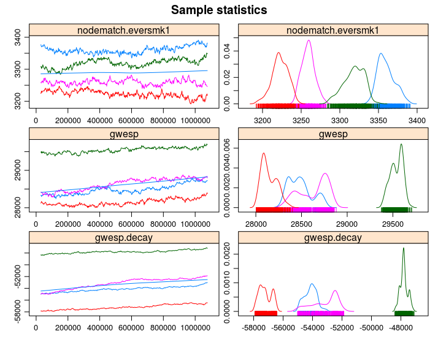

# Exponential Random Graph Models

I strongly suggest reading the vignette included in the `ergm` R package

```r
vignette("ergm", package="ergm")
```

So what are ERGMs anyway...

> The purpose of ERGMs, in a nutshell, is to describe parsimoniously the local selection forces
that shape the global structure of a network. To this end, a network dataset, like those
depicted in Figure 1, may be considered like the response in a regression model, where the
predictors are things like “propensity for individuals of the same sex to form partnerships” or
“propensity for individuals to form triangles of partnerships”. In Figure 1(b), for example, it
is evident that the individual nodes appear to cluster in groups of the same numerical labels
(which turn out to be students’ grades, 7 through 12); thus, an ERGM can help us quantify
the strength of this intra-group effect.  
>
> --- [@Hunter2008]


The distribution of $\mathbf{Y}$ can be parameterized in the form

$$
\Pr{\mathbf{Y}=\mathbf{y}|\theta, \mathcal{Y}} = \frac{\exp{\theta^{\mbox{T}}\mathbf{g}(\mathbf{y})}}{\kappa\left(\theta, \mathcal{Y}\right)},\quad\mathbf{y}\in\mathcal{Y}
(\#eq:04-1)
$$

Where $\theta\in\Omega\subset\mathbb{R}^q$ is the vector of model coefficients and $\mathbf{g}(\mathbf{y})$ is a *q*-vector of statistics based on the adjacency matrix $\mathbf{y}$.

Model \@ref(eq:04-1) may be expanded by replacing $\mathbf{g}(\mathbf{y})$ with $\mathbf{g}(\mathbf{y}, \mathbf{X})$ to allow for additional covariate information $\mathbf{X}$ about the network. The denominator,


$$
\kappa\left(\theta,\mathcal{Y}\right) = \sum_{\mathbf{z}\in\mathcal{Y}}\exp{\theta^{\mbox{T}}\mathbf{g}(\mathbf{z})}
$$

Is the normalizing factor that ensures that equation \@ref(eq:04-1) is a legitimate probability distribution. Even after fixing $\mathcal{Y}$ to be all the networks that have size $n$, the size of $\mathcal{Y}$ makes this type of models hard to estimate as there are $N = 2^{n(n-1)}$ possible networks! [@Hunter2008]

Recent developments include new forms of de-
pendency structures, to take into account more general neighborhood effects. These models
relax the one-step Markovian dependence assumptions, allowing investigation of longer range
configurations, such as longer paths in the network or larger cycles (Pattison and Robins
2002). Models for bipartite (Faust and Skvoretz 1999) and tripartite (Mische and Robins
2000) network structures have also been developed. [@Hunter2008 p. 9]

### A naive example

In the simplest case, ergm is equivalent to a logistic regression


```{r}
library(ergm)

data("sampson")

samplike

y <- sort(as.vector(as.matrix(samplike)))[-c(1:18)]
glm(y~1, family=binomial("logit"))

ergm(samplike ~ edges)
pr <- mean(y)
log(pr) - log(1-pr) # Logit function
qlogis(pr)
```

## Estimation of ERGMs

The ultimate goal is to be able to do statistical inference on the proposed model. In a *normal* setting, we would be able to use Maximum-Likelihood-Estimation (MLE) which basically consists on finding the model parameters $\theta$ that, given the observed data, maximizes the likelihood of the model. Such is usually done by applying [Newton's method](https://en.wikipedia.org/wiki/Newton%27s_method_in_optimization) which requires been able to compute the log-likelihood of the model. This is a bit more complicated in ERGMs.

In the case of ERGMs, since part of the likelihood involves a normalizing constant that is a function of all possible networks, this is not as straight forward as it is in the regular setting. This is why we rely on simulations.

In `statnet`, the default estimation method is based on a method proposed by [@Geyer1992], Markov-Chain MLE, which uses Markov-Chain Monte Carlo for simulating networks and a modified version of the Newton-Raphson algorihm to do the paremeter estimation part. In general terms, the MC-MLE algorithm can be described as follows:

1.  Initialize the algorithm with an initial guess of $\theta$, call it $\theta^{(t)}$

2.  While (no convergence) do:
    
    a.  Using $\theta^{(t)}$, simulate $M$ networks by means of small changes in the $\mathbf{Y}_{obs}$ (the observed network). This part is done by using an importance-sampling method which weights each proposed network by it's likelihood conditional on $\theta^{(t)}$
    
    b.  With the networks simulated, we can do the Newton step to update the parameter $\theta^{(t)}$ (this is the iteration part in the `ergm` package): $\theta^{(t)}\to\theta^{(t+1)}$
    
    c.  If convergence has been reach (which usually means that $\theta^{(t)}$ and $\theta^{(t + 1)}$ are not very different), then stop, otherwise, go to step a.

For more details see [@lusher2012;@admiraal2006;@Snijders2002;@Wang2009] provides details on the algorithm used by PNet (which is the same as the one used in `RSiena`). [@lusher2012] provides a short discussion on differences between `ergm` and `PNet`. 


## The `ergm` package

The `ergm` R package [@R-ergm]

From the previous section:^[You can download the 03.rda file from [this link](https://github.com/gvegayon/appliedsnar).]

```{r 04-setup, message=FALSE, warning=FALSE}
library(igraph)
library(magrittr)
library(dplyr)

load("03.rda")
```


In this section we will use the `ergm` package (from the `statnet` suit of packages [@R-statnet]) suit, and the `intergraph` [@R-intergraph] package. The latter provides functions to go back and forth between `igraph` and `network` objects from the `igraph` and `network` packages respectively^[Yes, the classes have the same name as the packages.]

```{r 03-ergms-setup, message=FALSE}
library(ergm)
library(intergraph)
```

As a rather important side note, the order in which R packages are loaded matters. Why is this important to mention now? Well, it turns out that at least a couple of functions in the `network` package have the same name of some functions in the `igraph` package. When the `ergm` package is loaded, since it depends on `network`, it will load the `network`  package first, which will _mask_ some functions in `igraph`. This becomes evident once you load `ergm` after loading `igraph`:
  
```
The following objects are masked from ‘package:igraph’:

  add.edges, add.vertices, %c%, delete.edges, delete.vertices, get.edge.attribute, get.edges,
  get.vertex.attribute, is.bipartite, is.directed, list.edge.attributes, list.vertex.attributes, %s%,
  set.edge.attribute, set.vertex.attribute
```

What are the implications of this? If you call the function `list.edge.attributes` for an object of class `igraph` R will return an error as the first function that matches that name comes from the `network` package! To avoid this you can use the double colon notation:

```r
igraph::list.edge.attributes(my_igraph_object)
network::list.edge.attributes(my_network_object)
```

Anyway... Using the `asNetwork` function, we can coerce the igraph object into a network object so we can use it with the `ergm` function:

```{r 03-ergms-intergraph, cache=TRUE}
# Creating the new network
network_111 <- intergraph::asNetwork(ig_year1_111)

# Running a simple ergm (only fitting edge count)
ergm(network_111 ~ edges)
```

So what happened here! We got a warning. It turns out that our network has loops (didn't thought about it before!). Let's take a look on that with the `which_loop` function

```{r 03-ergms-which-loop}
E(ig_year1_111)[which_loop(ig_year1_111)]
```

We can get rid of these using the `igraph::-.igraph`. Moreover, just to illustrate how it can be done, let's get rid of the isolates using the same operator

```{r 03-ergms-intergraph2, cache=TRUE, eval=TRUE}
# Creating the new network
network_111 <- ig_year1_111

# Removing loops
network_111 <- network_111 - E(network_111)[which(which_loop(network_111))]

# Removing isolates
network_111 <- network_111 - which(degree(network_111, mode = "all") == 0)

# Converting the network
network_111 <- intergraph::asNetwork(network_111)
```


`asNetwork(simplify(ig_year1_111))`
`ig_year1_111 %>% simplify %>% asNetwork`


## Running ERGMs

Proposed workflow:

1.  Estimate the simplest model, adding one variable at a time.

2.  After each estimation, run the `mcmc.diagnostics` function to see how good/bad behaved are the chains.

3.  Run the `gof` function to see how good is the model at matching the network's structural statistics.

What to use:

1.  `control.ergms`: Maximum number of iteration, seed for Pseudo-RNG, how many cores

2.  `ergm.constraints`: Where to sample the network from. Gives stability and (in some cases) faster convergence as by constraining the model you are reducing the sample size.

Here is an example of a couple of models that we could compare^[Notice that this document may not include the usual messages that the `ergm` command generates during the estimation procedure. This is just to make it more printable-friendly.]

```{r 04-ergms-model0, cache=TRUE, eval=TRUE, message=FALSE}
ans0 <- ergm(
  network_111 ~
    edges +
    nodematch("hispanic") +
    nodematch("female1") +
    nodematch("eversmk1") +
    mutual
    ,
  constraints = ~bd(maxout = 19),
  control = control.ergm(
    seed        = 1,
    MCMLE.maxit = 10,
    parallel    = 4,
    CD.maxit    = 10
    )
  )
```

So what are we doing here:

1.  The model is controling for: 
    
    a.  `edges` Number of edges in the network (as opposed to its density)
    
    b.  `nodematch("some-variable-name-here")` Includes a term that controls for homophily/heterophily
    
    c.  `mutual` Number of mutual connections between $(i, j), (j, i)$. This can be related to, for example, triadic closure.
    
For more on control parameters, see [@Morris2008].

```{r 04-ergms-model1, cache=TRUE, eval=TRUE, message=FALSE}
ans1 <- ergm(
  network_111 ~
    edges +
    nodematch("hispanic") +
    nodematch("female1") +
    nodematch("eversmk1")
    ,
  constraints = ~bd(maxout = 19),
  control = control.ergm(
    seed        = 1,
    MCMLE.maxit = 10,
    parallel    = 4,
    CD.maxit    = 10
    )
  )
```

This example takes longer to compute

```{r 04-ergms-model2, cache=TRUE, eval=TRUE, message=FALSE}
ans2 <- ergm(
  network_111 ~
    edges +
    nodematch("hispanic") +
    nodematch("female1") +
    nodematch("eversmk1") + 
    mutual +
    balance
    ,
  constraints = ~bd(maxout = 19),
  control = control.ergm(
    seed        = 1,
    MCMLE.maxit = 10,
    parallel    = 4,
    CD.maxit    = 10
    )
  )
```

Now, a nice trick to see all regressions in the same table, we can use the `texreg` package [@R-texreg] which supports `ergm` ouputs!

```{r 04-ergm-tabulation-screen}
library(texreg)
screenreg(list(ans0, ans1, ans2))
```

Or, if you are using rmarkdown, you can export the results using LaTeX or html, let's try the latter to see how it looks like here:

```{r 04-ergm-tabulation-html, results='asis', eval=knitr::is_html_output(), echo=knitr::is_html_output()}
library(texreg)
htmlreg(list(ans0, ans1, ans2))
```

```{r 04-ergm-tabulation-latex, results='asis', eval=knitr::is_latex_output(), echo=knitr::is_latex_output()}
library(texreg)
texreg(list(ans0, ans1, ans2))
```

```{r ergm-save-image, echo=FALSE, cache=TRUE}
save.image("ergm.rda", compress = TRUE)
```


## Model Goodness-of-Fit

In raw terms, once each chain has reach stationary distribution, we can say that there are no problems with autocorrelation and that each sample point is iid. This implies that, since we are running the model with more than 1 chain, we can use all the samples (chains) as a single dataset.

> Recent changes in the ergm estimation algorithm mean that these plots can no longer be used to ensure that the mean statistics from the model match the observed network statistics. For that functionality, please use the GOF command: gof(object, GOF=~model).
>
> ---?ergm::mcmc.diagnostics

Since `ans0` is the one model which did best, let's take a look at it's GOF statistics. First, lets see how the MCMC did. For this we can use the `mcmc.diagnostics` function including in the package. This function is actually a wrapper of a couple of functions from the `coda` package [@R-coda] which is called upon the `$sample` object which holds the *centered* statistics from the sampled networks. This last point is important to consider since at first look it can be confusing to look at the `$sample` object since it neither matches the observed statistics, nor the coefficients. 

When calling the function `mcmc.diagnostics(ans0, centered = FALSE)`, you will see a lot of output including a couple of plots showing the trace and posterior distribution of the *uncentered* statistics (`centered = FALSE`). In the next code chunks we will reproduce the output from the `mcmc.diagnostics` function step by step using the coda package. First we need to *uncenter* the sample object:

```{r ergm-uncentering}
# Getting the centered sample
sample_centered <- ans0$sample

# Getting the observed statistics and turning it into a matrix so we can add it
# to the samples
observed <- summary(ans0$formula)
observed <- matrix(
  observed,
  nrow  = nrow(sample_centered[[1]]),
  ncol  = length(observed),
  byrow = TRUE
  )

# Now we uncenter the sample
sample_uncentered <- lapply(sample_centered, function(x) {
  x + observed
})

# We have to make it an mcmc.list object
sample_uncentered <- coda::mcmc.list(sample_uncentered)
```


This is what is called under the hood:

1.  _Empirical means and sd, and quantiles_: 
    ```{r coda-summary}
    summary(sample_uncentered)
    ```
2.  _Cross correlation_: 
    ```{r coda-corr}
    coda::crosscorr(sample_uncentered)
    ```
3.  _Autocorrelation_: Just for now, we will only take a look at autocorrelation for chain 1 only. Autocorrelation should be rather low (in a general MCMC setting). If autocorrelation is high, then it means that your sample is not idd (no markov property). A way out to solve this is *thinning* the sample.
    ```{r coda-autocorr}
    coda::autocorr(sample_uncentered)[[1]]
    ```
4.  _Geweke Diagnostic_: From the function's help file:
    
    > "If the samples are drawn from the stationary distribution of the chain, the two means are equal and Geweke's statistic has an asymptotically standard normal distribution. [...]
    The Z-score is calculated under the assumption that the two parts of the chain are asymptotically independent, which requires that the sum of frac1 and frac2 be strictly less than 1.""
    >
    > ---?coda::geweke.diag 
    
    Let's take a look at a single chain:
    
    ```{r coda-geweke.diag}
    coda::geweke.diag(sample_uncentered)[[1]]
    ```
5.  _(not included) Gelman Diagnostic_: From the function's help file:
    
    > Gelman and Rubin (1992) propose a general approach to monitoring convergence of MCMC output in which m > 1 parallel chains are run with starting values that are overdispersed relative to the posterior distribution. Convergence is diagnosed when the chains have ‘forgotten’ their initial values, and the output from all chains is indistinguishable. The gelman.diag diagnostic is applied to a single variable from the chain. It is based a comparison of within-chain and between-chain variances, and is similar to a classical analysis of variance.
    > ---?coda::gelman.diag
    
    As a difference from the previous diagnostic statistic, this uses all chains simulatenously:
    
    ```{r coda-gelman.diag}
    coda::gelman.diag(sample_uncentered)
    ```
    
    As a rule of thumb, values that are in the $[.9,1.1]$ are good.
 
One nice feature of the `mcmc.diagnostics` function is the nice trace and posterior distribution plots that it generates. If you have the R package `latticeExtra` [@R-latticeExtra], the function will override the default plots used by `coda::plot.mcmc` and use lattice instead, creating a nicer looking plots. The next code chunk calls the `mcmc.diagnostic` function, but we suppress the rest of the output (see figure \@ref(fig:coda-plots)).


```{r coda-plots, fig.align='center', fig.height=8, cache=FALSE, echo=TRUE, results='hide', warning=FALSE, fig.cap=c("Trace and posterior distribution of sampled network statistics.", "Trace and posterior distribution of sampled network statistics (cont'd)."), fig.pos='!h'}
mcmc.diagnostics(ans0, center = FALSE) # Suppressing all the output
```


If we called the function `mcmc.diagnostics` this message appears at the end:

>
MCMC diagnostics shown here are from the last round of simulation, prior to computation of final parameter estimates. Because the final estimates are refinements of those used for this simulation run, these diagnostics may understate model performance. To directly assess the performance of the final model on in-model statistics, please use the GOF command: gof(ergmFitObject, GOF=~model).
>
> ---`mcmc.diagnostics(ans0)`

Not that bad (although the `mutual` term could do better)!^[The statnet wiki website as a very nice example of (very) bad and good mcmc diagnostics plots [here](https://statnet.org/trac/raw-attachment/wiki/Resources/ergm.fit.diagnostics.pdf).] First, observe that in the plot we see 4 different lines, why is that? Well, since we were running in parallel using 4 cores the algorithm actually ran 4 different chains of the MCMC algorithm. An eyeball test is to see if all the chains moved at about the same place, if we have that we can start thinking about model convergence from the mcmc perspective.

Once we are sure to have reach convergence on the MCMC algorithm, we can start thinking about how well does our model predicts the observed network's proterties. Besides of the statistics that define our ERGM, the `gof` function's default behavior show GOF for:

a.  In degree distribution,
b.  Out degree distribution,
c.  Edge-wise shared partners, and
d.  Geodesics

Let's take a look at it

```{r checking-gof, cache = TRUE, fig.pos='!h'}
# Computing and printing GOF estatistics
ans_gof <- gof(ans0)
ans_gof

# Plotting GOF statistics
plot(ans_gof)
```

Try the following configuration instead

```r
ans0_bis <- ergm(
  network_111 ~
    edges +
    nodematch("hispanic") +
    nodematch("female1") +
    mutual + 
    esp(0:3) + 
    idegree(0:10)
    ,
  constraints = ~bd(maxout = 19),
  control = control.ergm(
    seed        = 1,
    MCMLE.maxit = 15,
    parallel    = 4,
    CD.maxit    = 15,
    MCMC.samplesize = 2048*4,
    MCMC.burnin = 30000,
    MCMC.interval = 2048*4
    )
  )
```

Increase the sample size so the curves are more smooth, longer intervals (thinning) so we reduce the autocorrelation, larger burin. All this together to improve the Gelman test statistic. We also added idegree from 0 to 10, and esp from 0 to 3 to explicitly match those statistics in our model.

```{r badconvergence, fig.cap='An example of a terrible ERGM (no convergence at all). Also, a good example of why running multiple chains can be useful', fig.pos='!h'}

```


## More on MCMC convergence

For more on this issue, I recommend reviewing [chapter 1](http://www.mcmchandbook.net/HandbookChapter1.pdf) and [chapter 6](http://www.mcmchandbook.net/HandbookChapter6.pdf) from the Handbook of MCMC [@brooks2011]. Both chapters are free to download from the [book's website](http://www.mcmchandbook.net/HandbookSampleChapters.html).

For GOF take a look at section 6 of [ERGM 2016 Sunbelt tutorial](https://statnet.csde.washington.edu/trac/raw-attachment/wiki/Sunbelt2016/ergm_tutorial.html), and for a more technical review you can take a look at [@HunterJASA2008].
