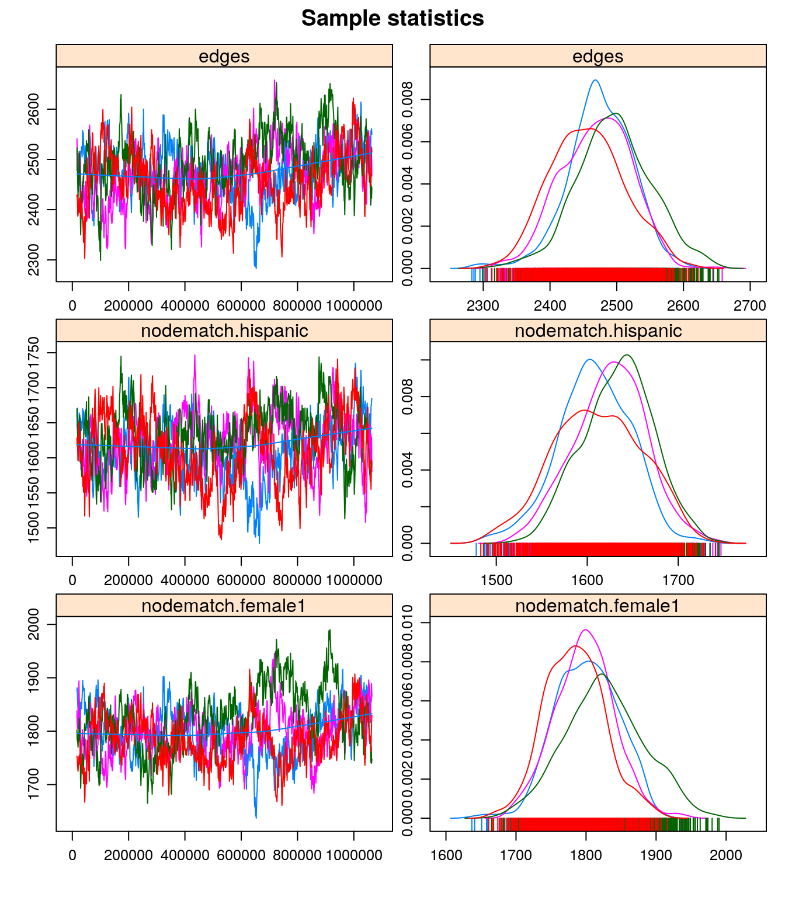
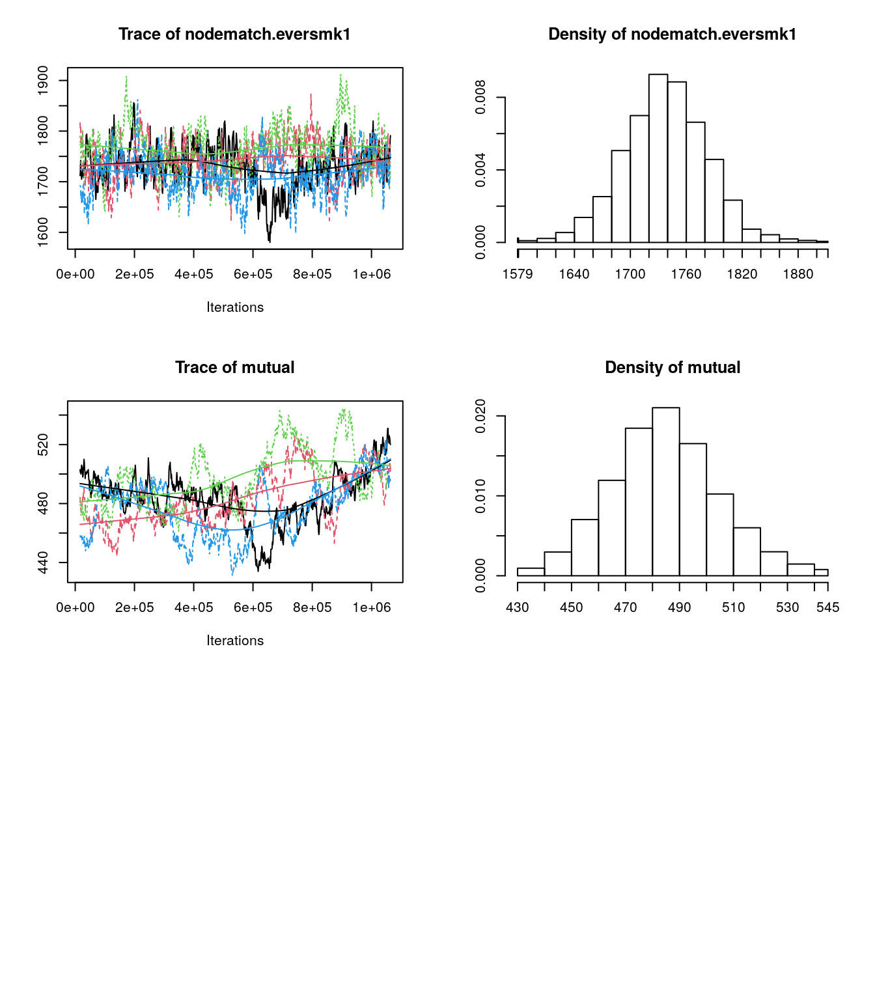
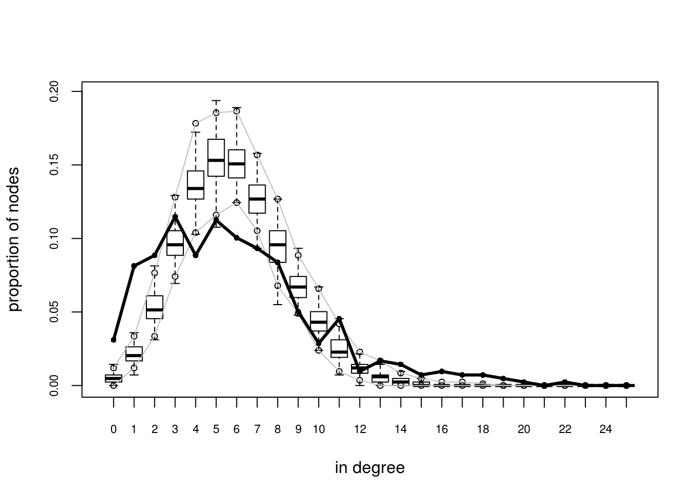
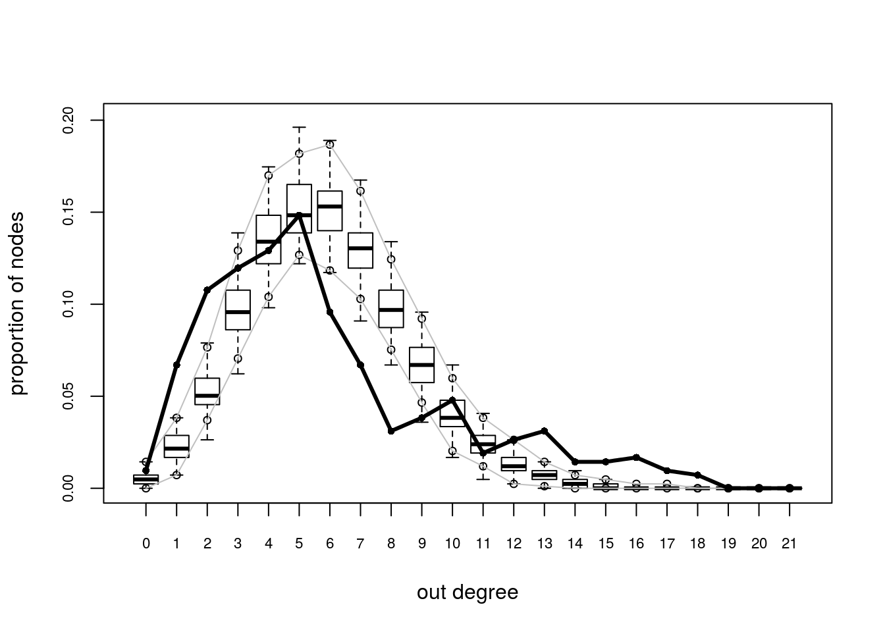
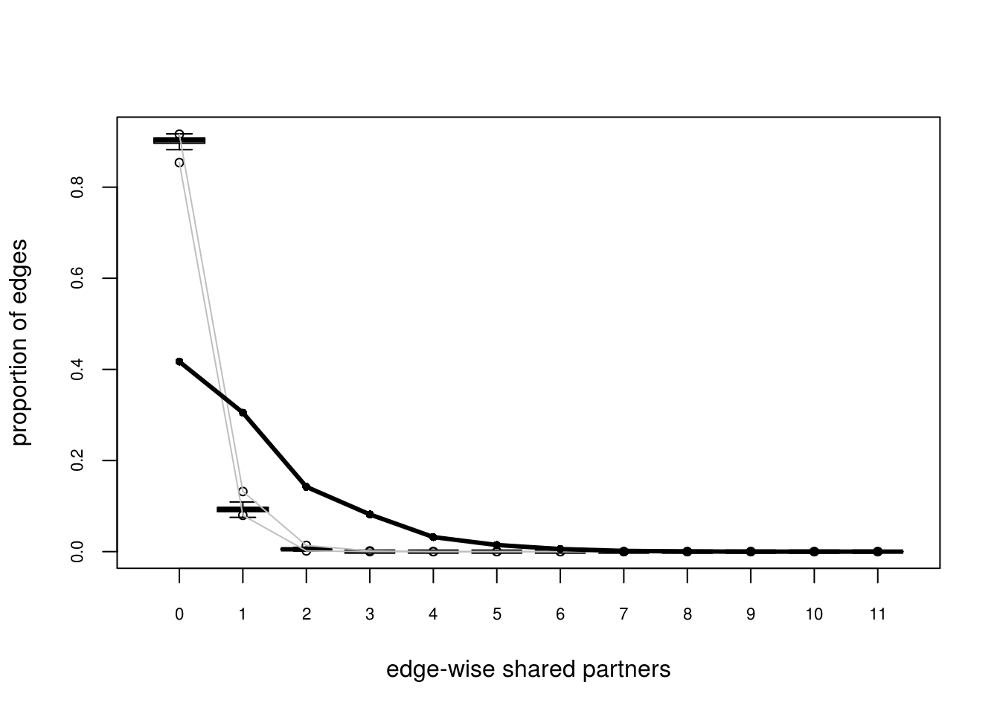
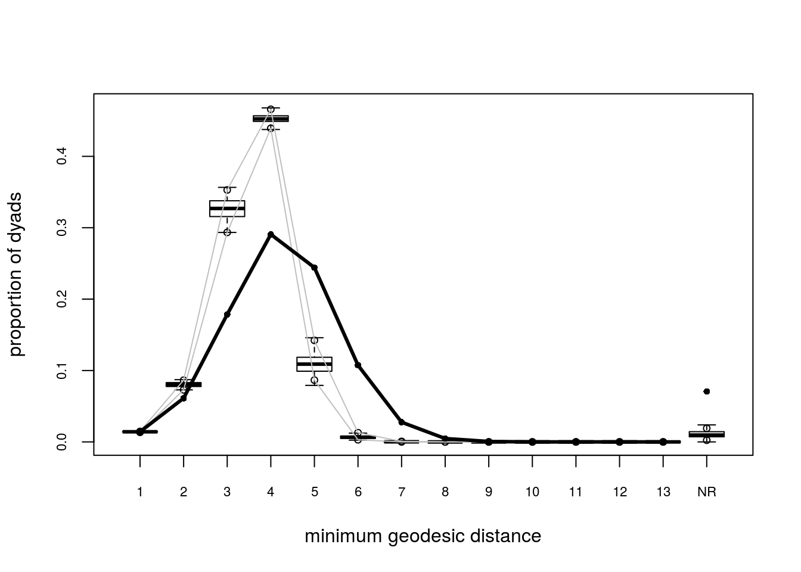
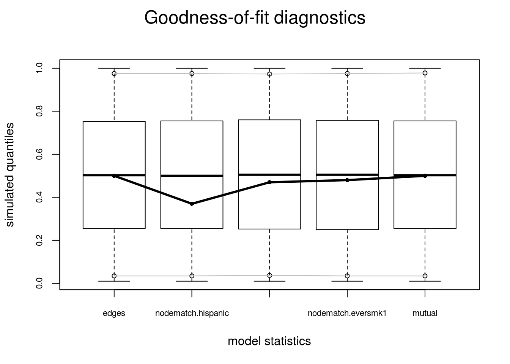
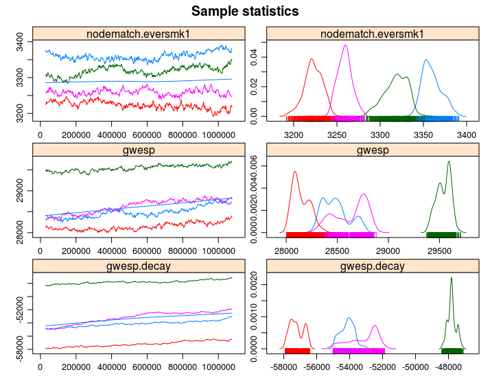

# Exponential Random Graph Models

I strongly suggest reading the vignette included in the `ergm` R package

```r
vignette("ergm", package="ergm")
```

> The purpose of ERGMs, in a nutshell, is to describe parsimoniously the local selection forces
that shape the global structure of a network. To this end, a network dataset, like those
depicted in Figure 1, may be considered as the response in a regression model, where the
predictors are things like "propensity for individuals of the same sex to form partnerships" or
"propensity for individuals to form triangles of partnerships". In Figure 1(b), for example, it
is evident that the individual nodes appear to cluster in groups of the same numerical labels
(which turn out to be students' grades, 7 through 12); thus, an ERGM can help us quantify
the strength of this intra-group effect.  
>
> --- [@Hunter2008]


In a nutshell, we use ERGMs as a parametric interpretation of the distribution of $\mathbf{Y}$,
which takes the canonical form:

$$
\Pr{\mathbf{Y}=\mathbf{y}|\theta, \mathcal{Y}} = \frac{\exp{\theta^{\mbox{T}}\mathbf{g}(\mathbf{y})}}{\kappa\left(\theta, \mathcal{Y}\right)},\quad\mathbf{y}\in\mathcal{Y}
(\#eq:04-1)
$$

Where $\theta\in\Omega\subset\mathbb{R}^q$ is the vector of model coefficients and $\mathbf{g}(\mathbf{y})$ is a *q*-vector of statistics based on the adjacency matrix $\mathbf{y}$.

Model \@ref(eq:04-1) may be expanded by replacing $\mathbf{g}(\mathbf{y})$ with $\mathbf{g}(\mathbf{y}, \mathbf{X})$ to allow for additional covariate information $\mathbf{X}$ about the network. The denominator,


$$
\kappa\left(\theta,\mathcal{Y}\right) = \sum_{\mathbf{y}\in\mathcal{Y}}\exp{\theta^{\mbox{T}}\mathbf{g}(\mathbf{y})}
$$

,is the normalizing factor that ensures that equation \@ref(eq:04-1) is a legitimate probability distribution. Even after fixing $\mathcal{Y}$ to be all the networks that have size $n$, the size of $\mathcal{Y}$ makes this type of statistical model hard to estimate as there are $N = 2^{n(n-1)}$ possible networks! [@Hunter2008]

Recent developments include new forms of dependency structures to take into account more general neighborhood effects. These models relax the one-step Markovian dependence assumptions, allowing investigation of longer-range configurations, such as longer paths in the network or larger cycles (Pattison and Robins 2002). Models for bipartite (Faust and Skvoretz 1999) and tripartite (Mische and Robins 2000) network structures have been developed. [@Hunter2008 p. 9]

## A naïve example

In the simplest case, ergm is equivalent to a logistic regression


```r
library(ergm)
```

```
## Loading required package: network
```

```
## network: Classes for Relational Data
## Version 1.16.1 created on 2020-10-06.
## copyright (c) 2005, Carter T. Butts, University of California-Irvine
##                     Mark S. Handcock, University of California -- Los Angeles
##                     David R. Hunter, Penn State University
##                     Martina Morris, University of Washington
##                     Skye Bender-deMoll, University of Washington
##  For citation information, type citation("network").
##  Type help("network-package") to get started.
```

```
## 
## ergm: version 3.11.0, created on 2020-10-14
## Copyright (c) 2020, Mark S. Handcock, University of California -- Los Angeles
##                     David R. Hunter, Penn State University
##                     Carter T. Butts, University of California -- Irvine
##                     Steven M. Goodreau, University of Washington
##                     Pavel N. Krivitsky, UNSW Sydney
##                     Martina Morris, University of Washington
##                     with contributions from
##                     Li Wang
##                     Kirk Li, University of Washington
##                     Skye Bender-deMoll, University of Washington
##                     Chad Klumb
##                     Michał Bojanowski, Kozminski University
##                     Ben Bolker
## Based on "statnet" project software (statnet.org).
## For license and citation information see statnet.org/attribution
## or type citation("ergm").
```

```
## NOTE: Versions before 3.6.1 had a bug in the implementation of the bd()
## constraint which distorted the sampled distribution somewhat. In
## addition, Sampson's Monks datasets had mislabeled vertices. See the
## NEWS and the documentation for more details.
```

```
## NOTE: Some common term arguments pertaining to vertex attribute and
## level selection have changed in 3.10.0. See terms help for more
## details. Use 'options(ergm.term=list(version="3.9.4"))' to use old
## behavior.
```

```r
data("sampson")

samplike
```

```
##  Network attributes:
##   vertices = 18 
##   directed = TRUE 
##   hyper = FALSE 
##   loops = FALSE 
##   multiple = FALSE 
##   total edges= 88 
##     missing edges= 0 
##     non-missing edges= 88 
## 
##  Vertex attribute names: 
##     cloisterville group vertex.names 
## 
##  Edge attribute names: 
##     nominations
```

```r
y <- sort(as.vector(as.matrix(samplike)))[-c(1:18)]
glm(y~1, family=binomial("logit"))
```

```
## 
## Call:  glm(formula = y ~ 1, family = binomial("logit"))
## 
## Coefficients:
## (Intercept)  
##     -0.9072  
## 
## Degrees of Freedom: 305 Total (i.e. Null);  305 Residual
## Null Deviance:	    367.2 
## Residual Deviance: 367.2 	AIC: 369.2
```

```r
ergm(samplike ~ edges)
```

```
## Starting maximum pseudolikelihood estimation (MPLE):
```

```
## Evaluating the predictor and response matrix.
```

```
## Maximizing the pseudolikelihood.
```

```
## Finished MPLE.
```

```
## Stopping at the initial estimate.
```

```
## Evaluating log-likelihood at the estimate.
```

```
## 
## Call:
## ergm(formula = samplike ~ edges)
## 
## 
## MLE Coefficients:
##   edges  
## -0.9072
```

```r
pr <- mean(y)
log(pr) - log(1-pr) # Logit function
```

```
## [1] -0.9071582
```

```r
qlogis(pr)
```

```
## [1] -0.9071582
```

## Estimation of ERGMs

The ultimate goal is to perform statistical inference on the proposed model. In a *standard* setting, we would be able to use Maximum-Likelihood-Estimation (MLE), which consists of finding the model parameters $\theta$ that, given the observed data, maximize the likelihood of the model. For the latter, we generally use [Newton's method](https://en.wikipedia.org/wiki/Newton%27s_method_in_optimization). Newton's method requires been able to compute the log-likelihood of the model, which in ERGMs can be challenging.

For ERGMs, since part of the likelihood involves a normalizing constant that is a function of all possible networks, this is not as straightforward as in the regular setting. Because of it, most estimation methods rely on simulations.

In `statnet`, the default estimation method is based on a method proposed by [@Geyer1992], Markov-Chain MLE, which uses Markov-Chain Monte Carlo for simulating networks and a modified version of the Newton-Raphson algorithm to estimate the parameters.

The idea of MC-MLE for this family of statistical models is that we can approximate the expectation of normalizing constant ratios using the law of large numbers. In particular, the following:

$$
\begin{aligned}
\frac{\kappa\left(\theta,\mathcal{Y}\right)}{\kappa\left(\theta_0,\mathcal{Y}\right)} & = %
  \frac{%
    \sum_{\mathbf{y}\in\mathcal{Y}}\exp{\theta^{\mbox{T}}\mathbf{g}(\mathbf{y})}}{ %
    \sum_{\mathbf{y}\in\mathcal{Y}}\exp{\theta_0^{\mbox{T}}\mathbf{g}(\mathbf{y})}
  } \\
& = \sum_{\mathbf{y}\in\mathcal{Y}}\left( %
  \frac{1}{%
    \sum_{\mathbf{y}\in\mathcal{Y}\exp{\theta_0^{\mbox{T}}\mathbf{g}(\mathbf{y})}}%
  } \times %
  \exp{\theta^{\mbox{T}}\mathbf{g}(\mathbf{y})} %
  \right) \\
& = \sum_{\mathbf{y}\in\mathcal{Y}}\left( %
  \frac{\exp{\theta_0^{\mbox{T}}\mathbf{g}(\mathbf{y})}}{%
    \sum_{\mathbf{y}\in\mathcal{Y}\exp{\theta_0^{\mbox{T}}\mathbf{g}(\mathbf{y})}}%
  } \times %
  \exp{(\theta - \theta_0)^{\mbox{T}}\mathbf{g}(\mathbf{y})} %
  \right) \\
& = \sum_{\mathbf{y}\in\mathcal{Y}}\left( %
  \Pr{Y = y|\mathcal{Y}, \theta_0} \times %
  \exp{(\theta - \theta_0)^{\mbox{T}}\mathbf{g}(\mathbf{y})} %
  \right) \\
& = \mbox{E}_{\theta_0}\left(\exp{(\theta - \theta_0)^{\mbox{T}}\mathbf{g}(\mathbf{y})} \right)
\end{aligned}
$$

In particular, the MC-MLE algorithm uses this fact to maximize the ratio of log-likelihoods. The objective function itself can be approximated by simulating $m$ networks from the distribution with parameter $\theta_0$:

$$
l(\theta) - l(\theta_0) \approx (\theta - \theta_0)^{\mbox{T}}\mathbf{g}(\mathbf{y}_{obs}) - 
\mbox{log}{\left[\frac{1}{m}\sum_{i = 1}^m\exp{(\theta-\theta_0)^{\mbox{T}}}\mathbf{g}(\mathbf{Y}_i)\right]}
$$

For more details, see [@Hunter2008]. A sketch of the algorithm follows:

1.  Initialize the algorithm with an initial guess of $\theta$, call it $\theta^{(t)}$ (must be a rather OK guess)

2.  While (no convergence) do:
    
    a.  Using $\theta^{(t)}$, simulate $M$ networks by means of small changes in the $\mathbf{Y}_{obs}$ (the observed network). This part is done by using an importance-sampling method which weights each proposed network by it's likelihood conditional on $\theta^{(t)}$
    
    b.  With the networks simulated, we can do the Newton step to update the parameter $\theta^{(t)}$ (this is the iteration part in the `ergm` package): $\theta^{(t)}\to\theta^{(t+1)}$.
    
    c.  If convergence has been reached (which usually means that $\theta^{(t)}$ and $\theta^{(t + 1)}$ are not very different), then stop; otherwise, go to step a.

For more details see [@lusher2012;@admiraal2006;@Snijders2002;@Wang2009] provides details on the algorithm used by PNet (which is the same as the one used in `RSiena`). [@lusher2012] provides a short discussion on differences between `ergm` and `PNet`. 


## The `ergm` package

The `ergm` R package [@R-ergm]

From the previous section:^[You can download the 03.rda file from [this link](https://github.com/gvegayon/appliedsnar).]


```r
library(igraph)
library(magrittr)
library(dplyr)

load("03.rda")
```


In this section we will use the `ergm` package (from the `statnet` suit of packages [@R-statnet]) suit, and the `intergraph` [@R-intergraph] package. The latter provides functions to go back and forth between `igraph` and `network` objects from the `igraph` and `network` packages respectively^[Yes, the classes have the same name as the packages.]


```r
library(ergm)
library(intergraph)
```

As a rather important side note, the order in which R packages are loaded matters. Why is this important to mention now? Well, it turns out that at least a couple of functions in the `network` package have the same name of some functions in the `igraph` package. When the `ergm` package is loaded, since it depends on `network`, it will load the `network`  package first, which will _mask_ some functions in `igraph`. This becomes evident once you load `ergm` after loading `igraph`:
  
```
The following objects are masked from ‘package:igraph’:

  add.edges, add.vertices, %c%, delete.edges, delete.vertices, get.edge.attribute, get.edges,
  get.vertex.attribute, is.bipartite, is.directed, list.edge.attributes, list.vertex.attributes, %s%,
  set.edge.attribute, set.vertex.attribute
```

What are the implications of this? If you call the function `list.edge.attributes` for an object of class `igraph` R will return an error as the first function that matches that name comes from the `network` package! To avoid this you can use the double colon notation:

```r
igraph::list.edge.attributes(my_igraph_object)
network::list.edge.attributes(my_network_object)
```

Anyway... Using the `asNetwork` function, we can coerce the igraph object into a network object so we can use it with the `ergm` function:


```r
# Creating the new network
network_111 <- intergraph::asNetwork(ig_year1_111)

# Running a simple ergm (only fitting edge count)
ergm(network_111 ~ edges)
```

```
## [1] "Warning:  This network contains loops"
## [1] "Warning:  This network contains loops"
```

```
## Starting maximum pseudolikelihood estimation (MPLE):
```

```
## Evaluating the predictor and response matrix.
```

```
## Maximizing the pseudolikelihood.
```

```
## Finished MPLE.
```

```
## Stopping at the initial estimate.
```

```
## Evaluating log-likelihood at the estimate.
```

```
## 
## MLE Coefficients:
##  edges  
## -4.734
```

So what happened here! We got a warning. It turns out that our network has loops (didn't thought about it before!). Let's take a look at that with the `which_loop` function


```r
E(ig_year1_111)[which_loop(ig_year1_111)]
```

```
## + 1/2638 edge from 44e92ea (vertex names):
## [1] 1110111->1110111
```

We can get rid of these using the `igraph::-.igraph`. Let's remove the isolates using the same operator


```r
# Creating the new network
network_111 <- ig_year1_111

# Removing loops
network_111 <- network_111 - E(network_111)[which(which_loop(network_111))]

# Removing isolates
network_111 <- network_111 - which(degree(network_111, mode = "all") == 0)

# Converting the network
network_111 <- intergraph::asNetwork(network_111)
```


`asNetwork(simplify(ig_year1_111))`
`ig_year1_111 %>% simplify %>% asNetwork`

A problem that we have on this data is the fact that some vertices have
missing values in the variables `hispanic`, `female1`, and `eversmk1`. For now,
we will proceed by imputing values based on the avareges:


```r
for (v in c("hispanic", "female1", "eversmk1")) {
  tmpv <- network_111 %v% v
  tmpv[is.na(tmpv)] <- mean(tmpv, na.rm = TRUE) > .5
  network_111 %v% v <- tmpv
}
```


## Running ERGMs

Proposed workflow:

1.  Estimate the simplest model, adding one variable at a time.

2.  After each estimation, run the `mcmc.diagnostics` function to see how good (or bad) behaved the chains are.

3.  Run the `gof` function and verify how good the model matches the network's structural statistics.

What to use:

1.  `control.ergms`: Maximum number of iteration, seed for Pseudo-RNG, how many cores

2.  `ergm.constraints`: Where to sample the network from. Gives stability and (in some cases) faster convergence as by constraining the model you are reducing the sample size.

Here is an example of a couple of models that we could compare^[Notice that this document may not include the usual messages that the `ergm` command generates during the estimation procedure. This is just to make it more printable-friendly.]


```r
ans0 <- ergm(
  network_111 ~
    edges +
    nodematch("hispanic") +
    nodematch("female1") +
    nodematch("eversmk1") +
    mutual
    ,
  constraints = ~bd(maxout = 19),
  control = control.ergm(
    seed        = 1,
    MCMLE.maxit = 10,
    parallel    = 4,
    CD.maxit    = 10
    )
  )
```

```
## Warning in nobs.ergm(object, ...): The number of observed dyads in this
## network is ill-defined due to complex constraints on the sample space.
## Disable this warning with 'options(ergm.loglik.warn_dyads=FALSE)'.

## Warning in nobs.ergm(object, ...): The number of observed dyads in this
## network is ill-defined due to complex constraints on the sample space.
## Disable this warning with 'options(ergm.loglik.warn_dyads=FALSE)'.
```

So what are we doing here:

1.  The model is controlling for: 
    
    a.  `edges` Number of edges in the network (as opposed to its density)
    
    b.  `nodematch("some-variable-name-here")` Includes a term that controls for homophily/heterophily
    
    c.  `mutual` Number of mutual connections between $(i, j), (j, i)$. This can be related to, for example, triadic closure.
    
For more on control parameters, see [@Morris2008].


```r
ans1 <- ergm(
  network_111 ~
    edges +
    nodematch("hispanic") +
    nodematch("female1") +
    nodematch("eversmk1")
    ,
  constraints = ~bd(maxout = 19),
  control = control.ergm(
    seed        = 1,
    MCMLE.maxit = 10,
    parallel    = 4,
    CD.maxit    = 10
    )
  )
```

```
## Warning in nobs.ergm(object, ...): The number of observed dyads in this
## network is ill-defined due to complex constraints on the sample space.
## Disable this warning with 'options(ergm.loglik.warn_dyads=FALSE)'.

## Warning in nobs.ergm(object, ...): The number of observed dyads in this
## network is ill-defined due to complex constraints on the sample space.
## Disable this warning with 'options(ergm.loglik.warn_dyads=FALSE)'.
```

This example takes longer to compute


```r
ans2 <- ergm(
  network_111 ~
    edges +
    nodematch("hispanic") +
    nodematch("female1") +
    nodematch("eversmk1") + 
    mutual +
    balance
    ,
  constraints = ~bd(maxout = 19),
  control = control.ergm(
    seed        = 1,
    MCMLE.maxit = 10,
    parallel    = 4,
    CD.maxit    = 10
    )
  )
```

```
## Warning in nobs.ergm(object, ...): The number of observed dyads in this
## network is ill-defined due to complex constraints on the sample space.
## Disable this warning with 'options(ergm.loglik.warn_dyads=FALSE)'.

## Warning in nobs.ergm(object, ...): The number of observed dyads in this
## network is ill-defined due to complex constraints on the sample space.
## Disable this warning with 'options(ergm.loglik.warn_dyads=FALSE)'.
```

Now, a nice trick to see all regressions in the same table, we can use the `texreg` package [@R-texreg] which supports `ergm` ouputs!


```r
library(texreg)
```

```
## Version:  1.37.5
## Date:     2020-06-17
## Author:   Philip Leifeld (University of Essex)
## 
## Consider submitting praise using the praise or praise_interactive functions.
## Please cite the JSS article in your publications -- see citation("texreg").
```

```
## 
## Attaching package: 'texreg'
```

```
## The following object is masked from 'package:magrittr':
## 
##     extract
```

```r
screenreg(list(ans0, ans1, ans2))
```

```
## Warning: This object was fit with 'ergm' version 3.10.4.5075 or earlier.
## Summarizing it with version 3.11 or later may return incorrect results or fail.

## Warning: This object was fit with 'ergm' version 3.10.4.5075 or earlier.
## Summarizing it with version 3.11 or later may return incorrect results or fail.

## Warning: This object was fit with 'ergm' version 3.10.4.5075 or earlier.
## Summarizing it with version 3.11 or later may return incorrect results or fail.
```

```
## 
## ===============================================================
##                     Model 1        Model 2        Model 3      
## ---------------------------------------------------------------
## edges                   -5.64 ***      -5.52 ***      -5.58 ***
##                         (0.05)         (0.06)         (0.06)   
## nodematch.hispanic       0.36 ***       0.50 ***       0.40 ***
##                         (0.04)         (0.04)         (0.04)   
## nodematch.female1        0.83 ***       1.10 ***       0.83 ***
##                         (0.04)         (0.05)         (0.04)   
## nodematch.eversmk1       0.35 ***       0.46 ***       0.36 ***
##                         (0.04)         (0.05)         (0.04)   
## mutual                   4.09 ***                     -3.55 ***
##                         (0.07)                        (0.25)   
## balance                                                0.02 ***
##                                                       (0.00)   
## ---------------------------------------------------------------
## AIC                 -32986.67      -31399.10      -33035.32    
## BIC                 -32936.32      -31358.82      -32974.91    
## Log Likelihood       16498.33       15703.55       16523.66    
## ===============================================================
## *** p < 0.001; ** p < 0.01; * p < 0.05
```

Or, if you are using rmarkdown, you can export the results using LaTeX or html, let's try the latter to see how it looks like here:


```r
library(texreg)
htmlreg(list(ans0, ans1, ans2))
```

```
## Warning: This object was fit with 'ergm' version 3.10.4.5075 or earlier.
## Summarizing it with version 3.11 or later may return incorrect results or fail.

## Warning: This object was fit with 'ergm' version 3.10.4.5075 or earlier.
## Summarizing it with version 3.11 or later may return incorrect results or fail.

## Warning: This object was fit with 'ergm' version 3.10.4.5075 or earlier.
## Summarizing it with version 3.11 or later may return incorrect results or fail.
```

<table class="texreg" style="margin: 10px auto;border-collapse: collapse;border-spacing: 0px;caption-side: bottom;color: #000000;border-top: 2px solid #000000;">
<caption>Statistical models</caption>
<thead>
<tr>
<th style="padding-left: 5px;padding-right: 5px;">&nbsp;</th>
<th style="padding-left: 5px;padding-right: 5px;">Model 1</th>
<th style="padding-left: 5px;padding-right: 5px;">Model 2</th>
<th style="padding-left: 5px;padding-right: 5px;">Model 3</th>
</tr>
</thead>
<tbody>
<tr style="border-top: 1px solid #000000;">
<td style="padding-left: 5px;padding-right: 5px;">edges</td>
<td style="padding-left: 5px;padding-right: 5px;">-5.64<sup>***</sup></td>
<td style="padding-left: 5px;padding-right: 5px;">-5.52<sup>***</sup></td>
<td style="padding-left: 5px;padding-right: 5px;">-5.58<sup>***</sup></td>
</tr>
<tr>
<td style="padding-left: 5px;padding-right: 5px;">&nbsp;</td>
<td style="padding-left: 5px;padding-right: 5px;">(0.05)</td>
<td style="padding-left: 5px;padding-right: 5px;">(0.06)</td>
<td style="padding-left: 5px;padding-right: 5px;">(0.06)</td>
</tr>
<tr>
<td style="padding-left: 5px;padding-right: 5px;">nodematch.hispanic</td>
<td style="padding-left: 5px;padding-right: 5px;">0.36<sup>***</sup></td>
<td style="padding-left: 5px;padding-right: 5px;">0.50<sup>***</sup></td>
<td style="padding-left: 5px;padding-right: 5px;">0.40<sup>***</sup></td>
</tr>
<tr>
<td style="padding-left: 5px;padding-right: 5px;">&nbsp;</td>
<td style="padding-left: 5px;padding-right: 5px;">(0.04)</td>
<td style="padding-left: 5px;padding-right: 5px;">(0.04)</td>
<td style="padding-left: 5px;padding-right: 5px;">(0.04)</td>
</tr>
<tr>
<td style="padding-left: 5px;padding-right: 5px;">nodematch.female1</td>
<td style="padding-left: 5px;padding-right: 5px;">0.83<sup>***</sup></td>
<td style="padding-left: 5px;padding-right: 5px;">1.10<sup>***</sup></td>
<td style="padding-left: 5px;padding-right: 5px;">0.83<sup>***</sup></td>
</tr>
<tr>
<td style="padding-left: 5px;padding-right: 5px;">&nbsp;</td>
<td style="padding-left: 5px;padding-right: 5px;">(0.04)</td>
<td style="padding-left: 5px;padding-right: 5px;">(0.05)</td>
<td style="padding-left: 5px;padding-right: 5px;">(0.04)</td>
</tr>
<tr>
<td style="padding-left: 5px;padding-right: 5px;">nodematch.eversmk1</td>
<td style="padding-left: 5px;padding-right: 5px;">0.35<sup>***</sup></td>
<td style="padding-left: 5px;padding-right: 5px;">0.46<sup>***</sup></td>
<td style="padding-left: 5px;padding-right: 5px;">0.36<sup>***</sup></td>
</tr>
<tr>
<td style="padding-left: 5px;padding-right: 5px;">&nbsp;</td>
<td style="padding-left: 5px;padding-right: 5px;">(0.04)</td>
<td style="padding-left: 5px;padding-right: 5px;">(0.05)</td>
<td style="padding-left: 5px;padding-right: 5px;">(0.04)</td>
</tr>
<tr>
<td style="padding-left: 5px;padding-right: 5px;">mutual</td>
<td style="padding-left: 5px;padding-right: 5px;">4.09<sup>***</sup></td>
<td style="padding-left: 5px;padding-right: 5px;">&nbsp;</td>
<td style="padding-left: 5px;padding-right: 5px;">-3.55<sup>***</sup></td>
</tr>
<tr>
<td style="padding-left: 5px;padding-right: 5px;">&nbsp;</td>
<td style="padding-left: 5px;padding-right: 5px;">(0.07)</td>
<td style="padding-left: 5px;padding-right: 5px;">&nbsp;</td>
<td style="padding-left: 5px;padding-right: 5px;">(0.25)</td>
</tr>
<tr>
<td style="padding-left: 5px;padding-right: 5px;">balance</td>
<td style="padding-left: 5px;padding-right: 5px;">&nbsp;</td>
<td style="padding-left: 5px;padding-right: 5px;">&nbsp;</td>
<td style="padding-left: 5px;padding-right: 5px;">0.02<sup>***</sup></td>
</tr>
<tr>
<td style="padding-left: 5px;padding-right: 5px;">&nbsp;</td>
<td style="padding-left: 5px;padding-right: 5px;">&nbsp;</td>
<td style="padding-left: 5px;padding-right: 5px;">&nbsp;</td>
<td style="padding-left: 5px;padding-right: 5px;">(0.00)</td>
</tr>
<tr style="border-top: 1px solid #000000;">
<td style="padding-left: 5px;padding-right: 5px;">AIC</td>
<td style="padding-left: 5px;padding-right: 5px;">-32986.67</td>
<td style="padding-left: 5px;padding-right: 5px;">-31399.10</td>
<td style="padding-left: 5px;padding-right: 5px;">-33035.32</td>
</tr>
<tr>
<td style="padding-left: 5px;padding-right: 5px;">BIC</td>
<td style="padding-left: 5px;padding-right: 5px;">-32936.32</td>
<td style="padding-left: 5px;padding-right: 5px;">-31358.82</td>
<td style="padding-left: 5px;padding-right: 5px;">-32974.91</td>
</tr>
<tr style="border-bottom: 2px solid #000000;">
<td style="padding-left: 5px;padding-right: 5px;">Log Likelihood</td>
<td style="padding-left: 5px;padding-right: 5px;">16498.33</td>
<td style="padding-left: 5px;padding-right: 5px;">15703.55</td>
<td style="padding-left: 5px;padding-right: 5px;">16523.66</td>
</tr>
</tbody>
<tfoot>
<tr>
<td style="font-size: 0.8em;" colspan="4"><sup>***</sup>p &lt; 0.001; <sup>**</sup>p &lt; 0.01; <sup>*</sup>p &lt; 0.05</td>
</tr>
</tfoot>
</table>


## Model Goodness-of-Fit

In raw terms, once each chain has reach stationary distribution, we can say that there are no problems with autocorrelation and that each sample point is iid. This implies that, since we are running the model with more than 1 chain, we can use all the samples (chains) as a single dataset.

> Recent changes in the ergm estimation algorithm mean that these plots can no longer be used to ensure that the mean statistics from the model match the observed network statistics. For that functionality, please use the GOF command: gof(object, GOF=~model).
>
> ---?ergm::mcmc.diagnostics

Since `ans0` is the one model which did best, let's take a look at it's GOF statistics. First, lets see how the MCMC did. For this we can use the `mcmc.diagnostics` function including in the package. This function is actually a wrapper of a couple of functions from the `coda` package [@R-coda] which is called upon the `$sample` object which holds the *centered* statistics from the sampled networks. This last point is important to consider since at first look it can be confusing to look at the `$sample` object since it neither matches the observed statistics, nor the coefficients. 

When calling the function `mcmc.diagnostics(ans0, centered = FALSE)`, you will see a lot of output including a couple of plots showing the trace and posterior distribution of the *uncentered* statistics (`centered = FALSE`). In the next code chunks we will reproduce the output from the `mcmc.diagnostics` function step by step using the coda package. First we need to *uncenter* the sample object:


```r
# Getting the centered sample
sample_centered <- ans0$sample

# Getting the observed statistics and turning it into a matrix so we can add it
# to the samples
observed <- summary(ans0$formula)
observed <- matrix(
  observed,
  nrow  = nrow(sample_centered[[1]]),
  ncol  = length(observed),
  byrow = TRUE
  )

# Now we uncenter the sample
sample_uncentered <- lapply(sample_centered, function(x) {
  x + observed
})

# We have to make it an mcmc.list object
sample_uncentered <- coda::mcmc.list(sample_uncentered)
```

Under the hood:

1.  _Empirical means and sd, and quantiles_: 
    
    ```r
    summary(sample_uncentered)
    ```
    
    ```
    ## 
    ## Iterations = 16384:1063936
    ## Thinning interval = 1024 
    ## Number of chains = 4 
    ## Sample size per chain = 1024 
    ## 
    ## 1. Empirical mean and standard deviation for each variable,
    ##    plus standard error of the mean:
    ## 
    ##                      Mean    SD Naive SE Time-series SE
    ## edges              2474.3 55.40   0.8656          4.129
    ## nodematch.hispanic 1836.5 43.56   0.6806          3.836
    ## nodematch.female1  1867.3 49.50   0.7735          4.900
    ## nodematch.eversmk1 1755.0 45.32   0.7081          2.926
    ## mutual              485.1 20.07   0.3136          3.544
    ## 
    ## 2. Quantiles for each variable:
    ## 
    ##                    2.5%  25%  50%  75% 97.5%
    ## edges              2365 2438 2475 2511  2580
    ## nodematch.hispanic 1747 1807 1838 1867  1918
    ## nodematch.female1  1778 1833 1866 1898  1975
    ## nodematch.eversmk1 1664 1726 1755 1784  1841
    ## mutual              446  472  485  498   527
    ```
2.  _Cross correlation_: 
    
    ```r
    coda::crosscorr(sample_uncentered)
    ```
    
    ```
    ##                        edges nodematch.hispanic nodematch.female1
    ## edges              1.0000000          0.8099803         0.8419023
    ## nodematch.hispanic 0.8099803          1.0000000         0.6845240
    ## nodematch.female1  0.8419023          0.6845240         1.0000000
    ## nodematch.eversmk1 0.8127786          0.6668579         0.6946880
    ## mutual             0.7144121          0.6064003         0.6720229
    ##                    nodematch.eversmk1    mutual
    ## edges                       0.8127786 0.7144121
    ## nodematch.hispanic          0.6668579 0.6064003
    ## nodematch.female1           0.6946880 0.6720229
    ## nodematch.eversmk1          1.0000000 0.5909593
    ## mutual                      0.5909593 1.0000000
    ```
3.  _Autocorrelation_: For now, we will only look at autocorrelation for chain one. Autocorrelation should be small (in a general MCMC setting). If autocorrelation is high, then it means that your sample is not idd (no Markov property). A way out to solve this is *thinning* the sample.
    
    ```r
    coda::autocorr(sample_uncentered)[[1]]
    ```
    
    ```
    ## , , edges
    ## 
    ##               edges nodematch.hispanic nodematch.female1 nodematch.eversmk1
    ## Lag 0     1.0000000          0.8139761         0.7795009          0.7837272
    ## Lag 1024  0.8868373          0.7222805         0.6971419          0.7006181
    ## Lag 5120  0.5948994          0.5251881         0.4922158          0.4847903
    ## Lag 10240 0.4600845          0.4504976         0.3755953          0.3949433
    ## Lag 51200 0.1982049          0.2079237         0.3221285          0.3131978
    ##              mutual
    ## Lag 0     0.6565207
    ## Lag 1024  0.6511008
    ## Lag 5120  0.6123226
    ## Lag 10240 0.5450916
    ## Lag 51200 0.3781621
    ## 
    ## , , nodematch.hispanic
    ## 
    ##               edges nodematch.hispanic nodematch.female1 nodematch.eversmk1
    ## Lag 0     0.8139761          1.0000000         0.6678498          0.5997413
    ## Lag 1024  0.7368708          0.8947521         0.6118379          0.5398809
    ## Lag 5120  0.5294057          0.6364242         0.4658087          0.3828159
    ## Lag 10240 0.4054664          0.4877295         0.3715878          0.2940047
    ## Lag 51200 0.2058656          0.1750285         0.3230496          0.2682960
    ##              mutual
    ## Lag 0     0.6338096
    ## Lag 1024  0.6235126
    ## Lag 5120  0.5759901
    ## Lag 10240 0.5148339
    ## Lag 51200 0.3923427
    ## 
    ## , , nodematch.female1
    ## 
    ##               edges nodematch.hispanic nodematch.female1 nodematch.eversmk1
    ## Lag 0     0.7795009          0.6678498         1.0000000          0.5886437
    ## Lag 1024  0.6998063          0.6046370         0.9102620          0.5273102
    ## Lag 5120  0.4930271          0.4699355         0.6838324          0.3701848
    ## Lag 10240 0.3680917          0.3863329         0.5241266          0.2933634
    ## Lag 51200 0.1291978          0.1212720         0.3078540          0.1884934
    ##              mutual
    ## Lag 0     0.6480628
    ## Lag 1024  0.6419102
    ## Lag 5120  0.6093541
    ## Lag 10240 0.5327467
    ## Lag 51200 0.3444436
    ## 
    ## , , nodematch.eversmk1
    ## 
    ##               edges nodematch.hispanic nodematch.female1 nodematch.eversmk1
    ## Lag 0     0.7837272          0.5997413         0.5886437          1.0000000
    ## Lag 1024  0.6948882          0.5391618         0.5277555          0.9024858
    ## Lag 5120  0.4488066          0.4103141         0.3543596          0.6426104
    ## Lag 10240 0.3440736          0.3622540         0.2786189          0.5235972
    ## Lag 51200 0.1413846          0.1251185         0.3037022          0.3427353
    ##              mutual
    ## Lag 0     0.5189905
    ## Lag 1024  0.5109281
    ## Lag 5120  0.4754632
    ## Lag 10240 0.4043018
    ## Lag 51200 0.2511635
    ## 
    ## , , mutual
    ## 
    ##               edges nodematch.hispanic nodematch.female1 nodematch.eversmk1
    ## Lag 0     0.6565207          0.6338096         0.6480628          0.5189905
    ## Lag 1024  0.6473638          0.6296240         0.6400673          0.5133709
    ## Lag 5120  0.6106484          0.6120531         0.6093092          0.4949412
    ## Lag 10240 0.5779115          0.6078153         0.5675734          0.4953194
    ## Lag 51200 0.3343059          0.3086253         0.4037995          0.4237535
    ##              mutual
    ## Lag 0     1.0000000
    ## Lag 1024  0.9825012
    ## Lag 5120  0.9123847
    ## Lag 10240 0.8212019
    ## Lag 51200 0.4968927
    ```
4.  _Geweke Diagnostic_: From the function's help file:
    
    > "If the samples are drawn from the stationary distribution of the chain, the two means are equal and Geweke's statistic has an asymptotically standard normal distribution. [...]
    The Z-score is calculated under the assumption that the two parts of the chain are asymptotically independent, which requires that the sum of frac1 and frac2 be strictly less than 1.""
    >
    > ---?coda::geweke.diag 
    
    Let's take a look at a single chain:
    
    
    ```r
    coda::geweke.diag(sample_uncentered)[[1]]
    ```
    
    ```
    ## 
    ## Fraction in 1st window = 0.1
    ## Fraction in 2nd window = 0.5 
    ## 
    ##              edges nodematch.hispanic  nodematch.female1 nodematch.eversmk1 
    ##             0.5295             0.4904             1.6354             0.6644 
    ##             mutual 
    ##             1.1170
    ```
5.  _(not included) Gelman Diagnostic_: From the function's help file:
    
    > Gelman and Rubin (1992) propose a general approach to monitoring convergence of MCMC output in which m > 1 parallel chains are run with starting values that are overdispersed relative to the posterior distribution. Convergence is diagnosed when the chains have ‘forgotten’ their initial values, and the output from all chains is indistinguishable. The gelman.diag diagnostic is applied to a single variable from the chain. It is based a comparison of within-chain and between-chain variances, and is similar to a classical analysis of variance.
    > ---?coda::gelman.diag
    
    As a difference from the previous diagnostic statistic, this uses all chains simulatenously:
    
    
    ```r
    coda::gelman.diag(sample_uncentered)
    ```
    
    ```
    ## Potential scale reduction factors:
    ## 
    ##                    Point est. Upper C.I.
    ## edges                    1.16       1.42
    ## nodematch.hispanic       1.10       1.28
    ## nodematch.female1        1.28       1.68
    ## nodematch.eversmk1       1.34       1.81
    ## mutual                   1.32       1.79
    ## 
    ## Multivariate psrf
    ## 
    ## 1.44
    ```
    
    As a rule of thumb, values that are in the $[.9,1.1]$ are good.
 
One nice feature of the `mcmc.diagnostics` function is the nice trace and posterior distribution plots that it generates. If you have the R package `latticeExtra` [@R-latticeExtra], the function will override the default plots used by `coda::plot.mcmc` and use lattice instead, creating a nicer looking plots. The next code chunk calls the `mcmc.diagnostic` function, but we suppress the rest of the output (see figure \@ref(fig:coda-plots)).


```r
mcmc.diagnostics(ans0, center = FALSE) # Suppressing all the output
```

<div class="figure" style="text-align: center">

<p class="caption">(\#fig:coda-plots-1)Trace and posterior distribution of sampled network statistics.</p>
</div><div class="figure" style="text-align: center">

<p class="caption">(\#fig:coda-plots-2)Trace and posterior distribution of sampled network statistics (cont'd).</p>
</div>


If we called the function `mcmc.diagnostics`, this message appears at the end:

>
MCMC diagnostics shown here are from the last round of simulation, prior to computation of final parameter estimates. Because the final estimates are refinements of those used for this simulation run, these diagnostics may understate model performance. To directly assess the performance of the final model on in-model statistics, please use the GOF command: gof(ergmFitObject, GOF=~model).
>
> ---`mcmc.diagnostics(ans0)`

Not that bad (although the `mutual` term could do better)!^[The statnet wiki website as a very nice example of (very) bad and good MCMC diagnostics plots [here](https://statnet.org/trac/raw-attachment/wiki/Resources/ergm.fit.diagnostics.pdf).] First, observe that in the figure we see four different lines; why is that? Since we were running in parallel using four cores, the algorithm ran four chains of the MCMC algorithm. An eyeball test is to see if all the chains moved at about the same place; in such a case, we can start thinking about model convergence from the MCMC perspective.

Once we are sure to have reach convergence on the MCMC algorithm, we can start thinking about how well does our model predicts the observed network's proterties. Besides the statistics that define our ERGM, the `gof` function's default behavior show GOF for:

a.  In degree distribution,
b.  Out degree distribution,
c.  Edge-wise shared partners, and
d.  Geodesics

Let's take a look at it


```r
# Computing and printing GOF estatistics
ans_gof <- gof(ans0)
ans_gof
```

```
## 
## Goodness-of-fit for in-degree 
## 
##    obs min  mean max MC p-value
## 0   13   0  1.89   8       0.00
## 1   34   3  9.04  18       0.00
## 2   37  11 23.63  33       0.00
## 3   48  28 41.83  59       0.44
## 4   37  41 56.87  75       0.00
## 5   47  44 64.71  84       0.04
## 6   42  39 63.33  85       0.02
## 7   39  42 53.78  74       0.00
## 8   35  25 40.58  60       0.50
## 9   21  14 26.19  43       0.38
## 10  12   9 17.37  26       0.16
## 11  19   2  9.53  17       0.00
## 12   4   0  4.93  11       0.90
## 13   7   0  2.35   7       0.04
## 14   6   0  1.27   5       0.00
## 15   3   0  0.44   3       0.02
## 16   4   0  0.21   2       0.00
## 17   3   0  0.05   1       0.00
## 18   3   0  0.00   0       0.00
## 19   2   0  0.00   0       0.00
## 20   1   0  0.00   0       0.00
## 22   1   0  0.00   0       0.00
## 
## Goodness-of-fit for out-degree 
## 
##    obs min  mean max MC p-value
## 0    4   0  1.85   5       0.20
## 1   28   3  8.99  15       0.00
## 2   45  12 23.25  35       0.00
## 3   50  24 40.87  52       0.06
## 4   54  42 57.89  76       0.68
## 5   62  49 66.04  85       0.70
## 6   40  41 62.23  79       0.00
## 7   28  37 54.08  70       0.00
## 8   13  29 40.05  52       0.00
## 9   16  17 27.65  41       0.00
## 10  20   8 16.72  30       0.46
## 11   8   2  9.30  19       0.76
## 12  11   1  4.98  11       0.04
## 13  13   0  2.38   7       0.00
## 14   6   0  0.97   4       0.00
## 15   6   0  0.50   3       0.00
## 16   7   0  0.17   1       0.00
## 17   4   0  0.06   1       0.00
## 18   3   0  0.01   1       0.00
## 19   0   0  0.01   1       1.00
## 
## Goodness-of-fit for edgewise shared partner 
## 
##       obs  min    mean  max MC p-value
## esp0 1032 2012 2210.11 2303          0
## esp1  755  156  222.10  441          0
## esp2  352    4   13.42   93          0
## esp3  202    0    0.77   19          0
## esp4   79    0    0.04    3          0
## esp5   36    0    0.00    0          0
## esp6   14    0    0.00    0          0
## esp7    4    0    0.00    0          0
## esp8    1    0    0.00    0          0
## 
## Goodness-of-fit for minimum geodesic distance 
## 
##       obs   min     mean   max MC p-value
## 1    2475  2301  2446.44  2568       0.56
## 2   10672 12062 13688.54 14617       0.00
## 3   31134 48722 55636.04 60092       0.00
## 4   50673 77284 79447.41 81661       0.00
## 5   42563 14452 20165.40 26886       0.00
## 6   18719   325  1274.88  2453       0.00
## 7    4808     1    51.78   361       0.00
## 8     822     0     2.13   102       0.00
## 9     100     0     0.06     4       0.00
## 10      7     0     0.01     1       0.00
## Inf 12333     0  1593.31  4558       0.00
## 
## Goodness-of-fit for model statistics 
## 
##                     obs  min    mean  max MC p-value
## edges              2475 2301 2446.44 2568       0.56
## nodematch.hispanic 1615 1499 1578.58 1662       0.32
## nodematch.female1  1814 1690 1791.16 1883       0.54
## nodematch.eversmk1 1738 1595 1716.19 1834       0.56
## mutual              486  436  475.48  504       0.50
```

```r
# Plotting GOF statistics
plot(ans_gof)
```



Try the following configuration instead

```r
ans0_bis <- ergm(
  network_111 ~
    edges +
    nodematch("hispanic") +
    nodematch("female1") +
    mutual + 
    esp(0:3) + 
    idegree(0:10)
    ,
  constraints = ~bd(maxout = 19),
  control = control.ergm(
    seed        = 1,
    MCMLE.maxit = 15,
    parallel    = 4,
    CD.maxit    = 15,
    MCMC.samplesize = 2048*4,
    MCMC.burnin = 30000,
    MCMC.interval = 2048*4
    )
  )
```

Increase the sample size, so the curves are smoother, longer intervals (thinning), which reduces autocorrelation, and a larger burin. All this together to improve the Gelman test statistic. We also added idegree from 0 to 10, and esp from 0 to 3 to explicitly match those statistics in our model.


```r

```

<div class="figure">

<p class="caption">(\#fig:badconvergence)An example of a terrible ERGM (no convergence at all). Also, a good example of why running multiple chains can be useful</p>
</div>


## More on MCMC convergence

For more on this issue, I recommend reviewing [chapter 1](http://www.mcmchandbook.net/HandbookChapter1.pdf) and [chapter 6](http://www.mcmchandbook.net/HandbookChapter6.pdf) from the Handbook of MCMC [@brooks2011]. Both chapters are free to download from the [book's website](http://www.mcmchandbook.net/HandbookSampleChapters.html).

For GOF take a look at section 6 of [ERGM 2016 Sunbelt tutorial](https://statnet.csde.washington.edu/trac/raw-attachment/wiki/Sunbelt2016/ergm_tutorial.html), and for a more technical review, you can take a look at [@HunterJASA2008].


## Mathematical Interpretation

One of the most critical parts of statistical modeling is interpreting the results,
if not the most important. In the case of ERGMs, a key aspect is based on change
statistics. Suppose that we would like to know how likely the tie $y_{ij}$ is to
happen, given the rest of the network. We can compute such probabilities using what
literature sometimes describes as the Gibbs-sampler. 

In particular, the log-odds of the $ij$ tie ocurring conditional on the rest of
the network can be written as:

\newcommand{\sufstats}[1]{s\left(#1\right)}
\renewcommand{\exp}[1]{\mbox{exp}\left\{#1\right\}}
\renewcommand{\log}[1]{\mbox{log}\left\{#1\right\}}
\newcommand{\transpose}[1]{{#1}^\mathbf{t}}
\renewcommand{\t}[1]{\transpose{#1}}

\newcommand{\s}[1]{\sufstats{#1}}
\newcommand{\SUFF}{\mathcal{S}}
\newcommand{\Suff}{\mathbf{S}}
\newcommand{\suff}{\mathbf{s}}

\newcommand{\isone}[1]{{\boldsymbol{1}\left( #1 \right)}}
\renewcommand{\Pr}[1]{{\mathbb{P}\left(#1\right) }}
\newcommand{\f}[1]{{f\left(#1\right) }}
\newcommand{\Prcond}[2]{{\mathbb{P}\left(#1\vphantom{#2}\;\right|\left.\vphantom{#1}#2\right)}}
\newcommand{\fcond}[2]{{f\left(#1|#2\right) }}
\newcommand{\Expected}[1]{{\mathbb{E}\left\{#1\right\}}}
\newcommand{\ExpectedCond}[2]{{\mathbb{E}\left\{#1\vphantom{#2}\right|\left.\vphantom{#1}#2\right\}}}
\renewcommand{\exp}[1]{\mbox{exp}\left\{#1\right\}}

\newcommand{\Likelihood}[2]{\text{L}\left(#1 \left|\vphantom{#1}#2\right.\right)}

\newcommand{\loglik}[1]{l\left(#1\right)}
\newcommand{\logit}[1]{\mbox{logit}\left(#1\right)}
\newcommand{\chng}[1]{\delta\left(y_{#1}:0\to1\right)}

\newcommand{\pgraph}{\mathbf{x}}
\newcommand{\snamed}[2]{\s{#1}_{\mbox{#2}}}


\begin{equation}
	\logit{\Pr{y_{ij} = 1|y_{-ij}}} = \transpose{\theta}\Delta\chng{ij},
\end{equation}

\noindent with $\chng{ij}\equiv \snamed{\mathbf{y}}{ij}^+ - \snamed{\mathbf{y}}{ij}^-$ as
the vector of change statistics, in other words, the difference between the
sufficient statistics when $y_{ij}=1$ and its value when $y_{ij} = 0$. To show
this, we write the following:

\begin{align*}
	\Pr{y_{ij} = 1|y_{-ij}} & = %
		\frac{\Pr{y_{ij} = 1, x_{-ij}}}{%
			\Pr{y_{ij} = 1, y_{-ij}} + \Pr{y_{ij} = 0, y_{-ij}}} \\
		& = \frac{\exp{\transpose{\theta}\s{\mathbf{y}}^+_{ij}}}{%
			\exp{\transpose{\theta}\s{\mathbf{y}}^+_{ij}} + \exp{\transpose{\theta}\s{\mathbf{y}}^-_{ij}}}
\end{align*}

Applying the logit function to the previous equation, we obtain:

\begin{align*}
& = \log{\frac{\exp{\transpose{\theta}\s{\mathbf{y}}^+_{ij}}}{%
		\exp{\transpose{\theta}\s{\mathbf{y}}^+_{ij}} + %
		\exp{\transpose{\theta}\s{\mathbf{y}}^-_{ij}}}} - %
	\log{ %
		\frac{\exp{\transpose{\theta}\s{\mathbf{y}}^-_{ij}}}{%
			\exp{\transpose{\theta}\s{\mathbf{y}}^+_{ij}} + \exp{\transpose{\theta}\s{\mathbf{y}}^-_{ij}}}%
	 } \\
 & = \log{\exp{\transpose{\theta}\s{\mathbf{y}}^+_{ij}}} - \log{\exp{\transpose{\theta}\s{\mathbf{y}}^-_{ij}}} \\
 & = \transpose{\theta}\left(\s{\mathbf{y}}^+_{ij} - \s{\mathbf{y}}^-_{ij}\right) \\
 & = \transpose{\theta}\Delta\chng{ij}
\end{align*}
\noindent Henceforth, the conditional probability of node $n$ gaining function $k$ can be written as:

\begin{equation}
	\Pr{y_{ij} = 1|y_{-ij}} = \frac{1}{1 + \exp{-\transpose{\theta}\Delta\chng{ij}}}
\end{equation}

\noindent i.e., a logistic probability.

## Markov independence

The challenge of analyzing networks is their interdependent nature. Nonetheless, in the absence of such interdependence, ERGMs are equivalent to logistic regression. Conceptually, if all the statistics included in the model do not involve two or more dyads, then the model is non-Markovian in the sense of Markov graphs.

Mathematically, to see this, it suffices to show that the ERGM probability can be written as the product of each dyads' probabilities. 

\begin{equation*}
\Pr{\mathbf{y} | \theta} = \frac{\exp{\transpose{\theta}\s{\mathbf{y}}}}{\sum_{y}\exp{\transpose{\theta}\s{\mathbf{y}}}} 
= \frac{\prod_{ij}\exp{\transpose{\theta}\s{\mathbf{y}}_{ij}}}{\sum_{y}\exp{\transpose{\theta}\s{\mathbf{y}}}}
\end{equation*}

Where $\s{}_{ij}$ is a function such that $\s{\mathbf{y}} = \sum_{ij}{\s{\mathbf{y}}_{ij}}$. We now need to deal with the normalizing constant. To see how that can be saparated, let's start from the result:

\newcommand{\thetaS}[1]{\exp{\transpose{\theta}\s{\mathbf{y}}_{#1}}}

\begin{align*}
& =\prod_{ij}\left(1 + \thetaS{ij}\right) \\
& = \left(1 + \thetaS{11}\right)\left(1 + \thetaS{12}\right)\dots\left(1 + \thetaS{nn}\right) \\
& = 1 + \thetaS{11} + \thetaS{11}\thetaS{12} + \dots + \prod_{ij}\thetaS{ij} \\
& = 1 + \thetaS{11} + \exp{\transpose{\theta}\left(\s{\mathbf{y}}_{11} + \s{\mathbf{y}}_{12}\right)} + \dots + \prod_{ij}\thetaS{ij} \\
& = \sum_{\mathbf{y}\in\mathcal{Y}}\exp{\transpose{\theta}\s{\mathbf{y}}}
\end{align*}

Where the last equality follows from $\s{\mathbf{y}} = \sum_{ij}{\s{\mathbf{y}}_{ij}}$. This way, we can now write:

\begin{equation}
\frac{\prod_{ij}\exp{\transpose{\theta}\s{\mathbf{y}}_{ij}}}{\sum_{y}\exp{\transpose{\theta}\s{\mathbf{y}}}} = 
\prod_{ij}\frac{\exp{\transpose{\theta}\s{\mathbf{y}}_{ij}}}{1 + \exp{\transpose{\theta}\s{\mathbf{y}}_{ij}}}
\end{equation}

\pagebreak
