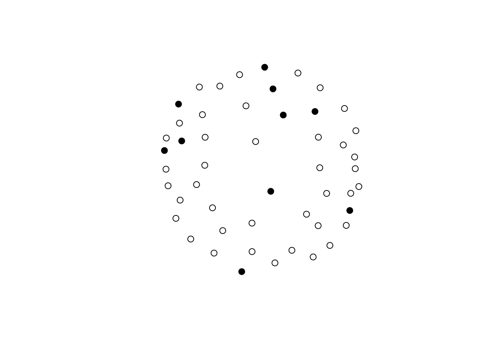
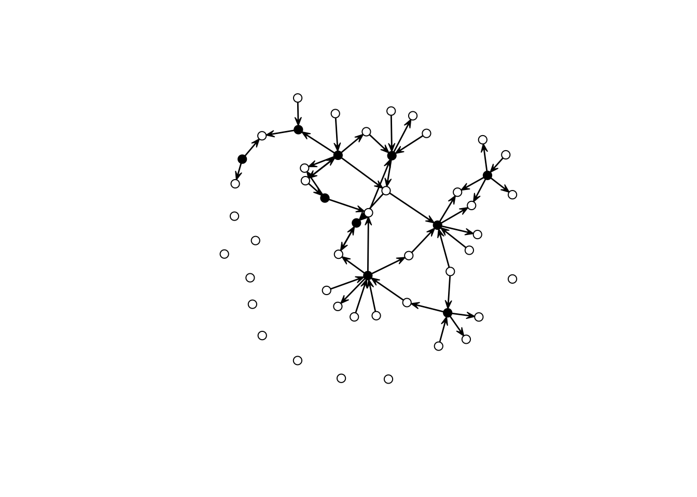
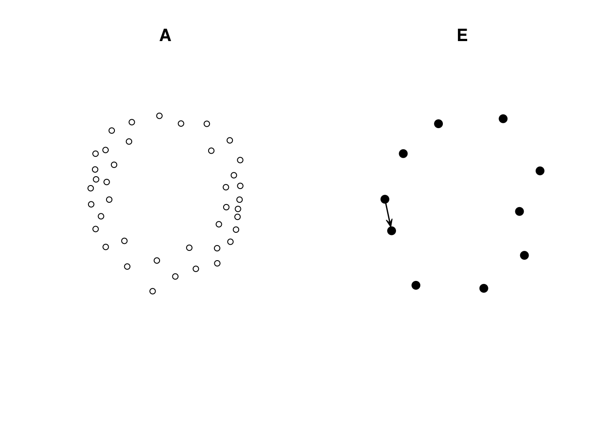
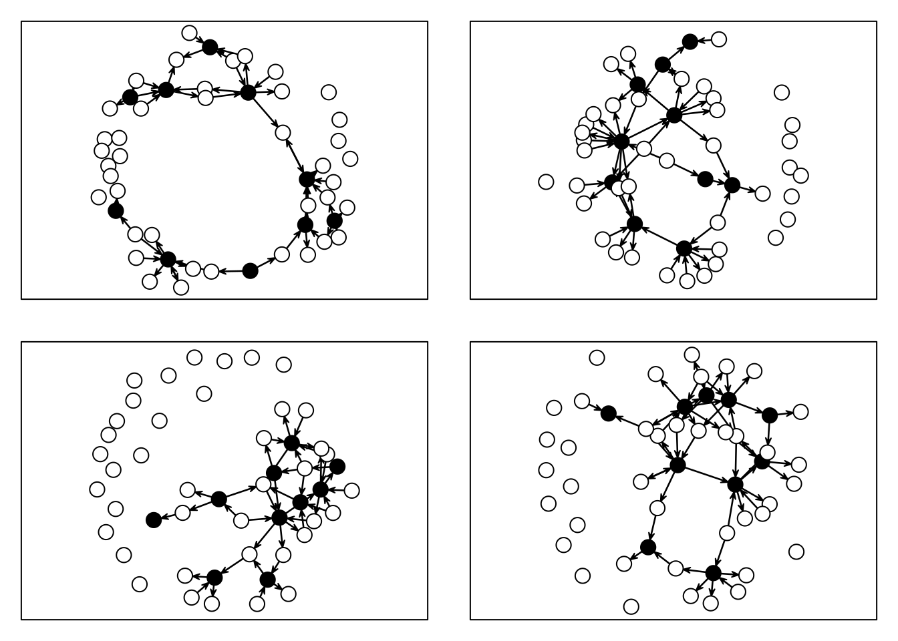

# Using constraints in ERGMs


Exponential Random Graph Models [ERGMs] can represent a variety of
network classes. We often look at "regular" social networks
like students in schools, colleagues in a workplace, or families. Nonetheless,
some social networks we study have features that restrict how connections can
occur. Typical examples are [bi-partite graphs](https://en.wikipedia.org/wiki/Bipartite_graph)
and [multilevel networks](https://cran.r-project.org/web/packages/mlergm/vignettes/mlergm_tutorial.html).
There are two classes of vertices in bi-partite networks, and ties can only
occur between classes. On the other hand, Multilevel networks may feature
multiple classes with inter-class ties somewhat restricted. In both cases,
structural constraints exist, meaning that some configurations may not
be plausible.

Mathematically, what we are trying to do is, instead of assuming that
all network configurations are possible:

$$
\left\{\mathbf{y} \in \mathcal{Y}: y_{ij} = 0, \forall i = j\right\}
$$

\noindent we want to go a bit further avoiding loops, namely:


$$
\left\{\mathbf{y} \in \mathcal{Y}: y_{ij} = 0, \forall i = j; \mathbf{y} \in C\right\}
$$,

\noindent where $C$ is a constraint, for example, only networks with no triangles.
The `ergm` R package has built-in capabilities to deal with some of these
cases. Nonetheless, we can specify models with arbitrary
structural constraints built into the model. The key is in using offset terms.

## Example 1: Interlocking egos and disconnected alters

Imagine that we have two sets of vertices. The first, group `E`, are egos part of
an egocentric study. The second group, called `A`, is composed of people mentioned by egos in `E` but
were not surveyed. Assume that individuals in `A` can only connect
to individuals in `E`; moreover, individuals in `E` have no restrictions connecting to each other. 
In other words, only two types of ties exist: `E-E` and `A-E`. The question is
now, how can we enforce such a constraint in an ERGM?

Using offsets, and in particular, setting coefficients to `-Inf` provides
an easy way to restrict the support set of ERGMs. For example, if we wanted
to constrain the support to include networks with no triangles, we would
add the term `offset(triangle)` and use the option `offset.coef = -Inf` to
indicate that realizations including triangles are not possible. Using R:


```r
ergm(net ~ edges + offset(triangle), offset.coef = -Inf)
```

In this model, a Bernoulli graph, we reduce the sample space to networks
with no triangles. In our example, such statistic should only take non-zero
values whenever ties within the `A` class happen. We can use
the `nodematch()` term to do that. Formally

$$
\text{NodeMatch}(x) = \sum_{i,j} y_{ij} \mathbf{1}({x_{i} = x_{j}})
$$

This statistic will sum over all ties in which source ($i$) and target ($j$)'s
$X$ attribute is equal. One way to make this happen is by creating an auxiliary
variable that equals, e.g., 0 for all vertices in `A`, and a unique value
different from zero otherwise. For example, if we had 2 `A`s and three `E`s,
the data would look something like this: $\{0,0,1,2,3\}$. The following code
block creates an empty graph with 50 nodes, 10 of which are in group `E` (ego).


```r
library(ergm, quietly =  TRUE)
library(sna, quietly =  TRUE)

n <- 50
n_egos <- 10
net <- as.network(matrix(0, ncol = n, nrow = n), directed = TRUE)

# Let's assing the groups
net %v% "is.ego" <- c(rep(TRUE, n_egos), rep(FALSE, n - n_egos))
net %v% "is.ego"
```

```
##  [1]  TRUE  TRUE  TRUE  TRUE  TRUE  TRUE  TRUE  TRUE  TRUE  TRUE FALSE FALSE
## [13] FALSE FALSE FALSE FALSE FALSE FALSE FALSE FALSE FALSE FALSE FALSE FALSE
## [25] FALSE FALSE FALSE FALSE FALSE FALSE FALSE FALSE FALSE FALSE FALSE FALSE
## [37] FALSE FALSE FALSE FALSE FALSE FALSE FALSE FALSE FALSE FALSE FALSE FALSE
## [49] FALSE FALSE
```

```r
gplot(net, vertex.col = net %v% "is.ego")
```



To create the auxiliary variable, we will use the following function:


```r
# Function that creates an aux variable for the ergm model
make_aux_var <- function(my_net, is_ego_dummy) {
  
  n_vertex <- length(my_net %v% is_ego_dummy)
  n_ego_   <- sum(my_net %v% is_ego_dummy)
  
  # Creating an auxiliary variable to identify the non-informant non-informant ties
  my_net %v% "aux_var" <- ifelse(
    !my_net %v% is_ego_dummy, 0, 1:(n_vertex - n_ego_)
    )

  my_net
}
```


Calling the function in our data results in the following:


```r
net <- make_aux_var(net, "is.ego")

# Taking a look over the first 15 rows of data
cbind(
  Is_Ego = net %v% "is.ego",
  Aux    = net %v% "aux_var"  
) |> head(n = 15)
```

```
##       Is_Ego Aux
##  [1,]      1   1
##  [2,]      1   2
##  [3,]      1   3
##  [4,]      1   4
##  [5,]      1   5
##  [6,]      1   6
##  [7,]      1   7
##  [8,]      1   8
##  [9,]      1   9
## [10,]      1  10
## [11,]      0   0
## [12,]      0   0
## [13,]      0   0
## [14,]      0   0
## [15,]      0   0
```

We can now use this data to simulate a network in which ties between
`A`-class vertices are not possible:


```r
set.seed(2828)
net_sim <- simulate(net ~ edges + nodematch("aux_var"), coef = c(-3.0, -Inf))
gplot(net_sim, vertex.col = net_sim %v% "is.ego")
```



As you can see, this network has only ties of the type `E-E` and `A-E`. We can
double-check by (i) looking at the counts and (ii) visualizing each induced-subgraph
separately:


```r
summary(net_sim ~ edges + nodematch("aux_var"))
```

```
##             edges nodematch.aux_var 
##                49                 0
```

```r
net_of_alters <- get.inducedSubgraph(
  net_sim, which((net_sim %v% "aux_var") == 0)
  )

net_of_egos <- get.inducedSubgraph(
  net_sim, which((net_sim %v% "aux_var") != 0)
  )

# Counts
summary(net_of_alters ~ edges + nodematch("aux_var"))
```

```
##             edges nodematch.aux_var 
##                 0                 0
```

```r
summary(net_of_egos ~ edges + nodematch("aux_var"))
```

```
##             edges nodematch.aux_var 
##                 1                 0
```

```r
# Figures
op <- par(mfcol = c(1, 2))
gplot(net_of_alters, vertex.col = net_of_alters %v% "is.ego", main = "A")
gplot(net_of_egos, vertex.col = net_of_egos %v% "is.ego", main = "E")
```



```r
par(op)
```

Now, to fit an ERGM with this constraint, we simply need to make use of
the offset terms. Here is an example:


```r
ans <- ergm(
  net_sim ~ edges + offset(nodematch("aux_var")), # The model (notice the offset)
  offset.coef = -Inf                              # The offset coefficient
  )
## Starting maximum pseudolikelihood estimation (MPLE):
## Evaluating the predictor and response matrix.
## Maximizing the pseudolikelihood.
## Finished MPLE.
## Stopping at the initial estimate.
## Evaluating log-likelihood at the estimate.
summary(ans)
## Call:
## ergm(formula = net_sim ~ edges + offset(nodematch("aux_var")), 
##     offset.coef = -Inf)
## 
## Maximum Likelihood Results:
## 
##                           Estimate Std. Error MCMC % z value Pr(>|z|)    
## edges                       -2.843      0.147      0  -19.34   <1e-04 ***
## offset(nodematch.aux_var)     -Inf      0.000      0    -Inf   <1e-04 ***
## ---
## Signif. codes:  0 '***' 0.001 '**' 0.01 '*' 0.05 '.' 0.1 ' ' 1
## 
##      Null Deviance: 3396  on 2450  degrees of freedom
##  Residual Deviance: 2542  on 2448  degrees of freedom
##  
## AIC: 2544  BIC: 2550  (Smaller is better. MC Std. Err. = 0)
## 
##  The following terms are fixed by offset and are not estimated:
##   offset(nodematch.aux_var)
```

This ERGM model--which by the way only featured dyadic-independent terms, and
thus can be reduced to a logistic regression--restricts the support by excluding
all networks in which ties within the class `A` exists. To finalize, let's look
at a few simulations based on this model:


```r
set.seed(1323)
op <- par(mfcol = c(2,2), mar = rep(1, 4))
for (i in 1:4) {
  gplot(simulate(ans), vertex.col = net %v% "is.ego", vertex.cex = 2)
  box()
}
```



```r
par(op)
```

All networks with no ties between `A` nodes.
