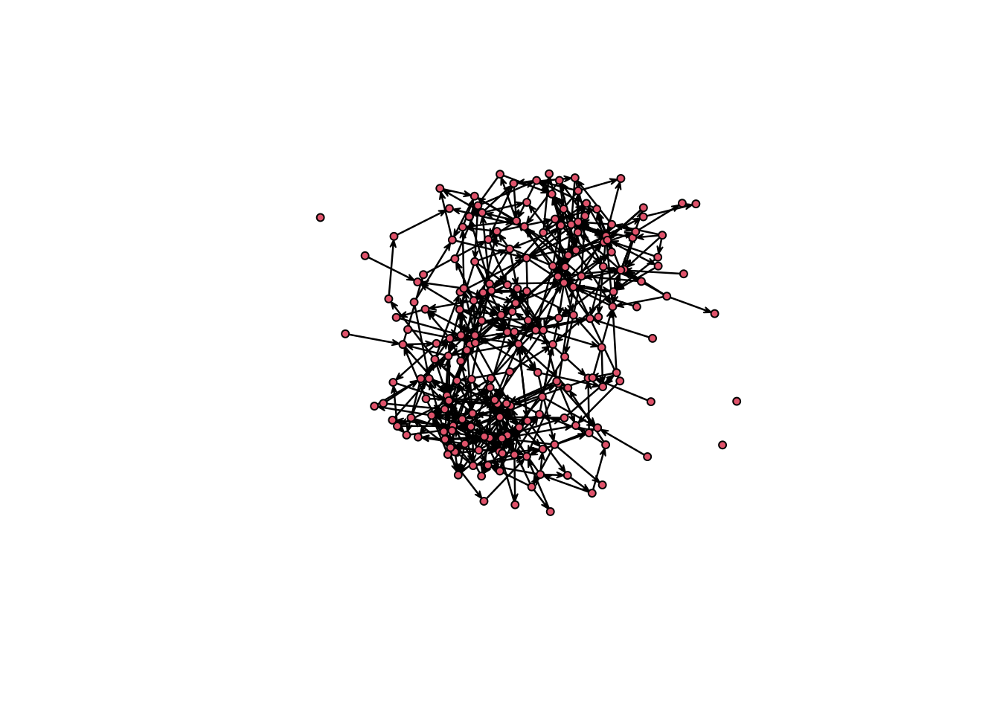

# Simulating and visualizing networks

In this chapter, we will build and visualize artificial networks using Exponential
Random Graph Models [ERGMs.] Together with chapter 3, this will be an extended 
example of how to read network data and visualize it using some of the available
R packages out there.

For this chapter we will be using the following R packages: `ergm`, `sna`, `igraph`,
`intergraph`, `netplot`, `netdiffuseR`, and `rgexf`.

## Random Graph Models

While there are tons of social network data, we will use an artificial one for this chapter.
We do this as it is always helpful to have more examples simulating Random
networks. For this chapter, we will classify random graph models for sampling and
generating networks into three categories:

1. **Exogenous**: Graphs where the structure is determined by a macro rule, e.g., 
expected density, degree distribution, or degree-sequence. In these cases,
ties are assigned to comply with a macro-property.

2. **Endogenous**: This category includes all Random Graphs generated based
on endogenous information, e.g., small-world, scale-free, etc. Here, a tie 
creation rule gives origin to a macro property, for example, preferential attachment
in scale-free networks.

3. **Exponential Random Graph Models**: Overall, since ERGMs compose a family
of statistical models, we can always (or almost always) find a model specification
that matches the previous categories. Whereas we are thinking about degree sequence,
preferential attachment, or a mix of both, ERGMs can be the baseline for any of
those models.

The later, ERGMs, are a generalization that covers all classes. Because of that,
we will use ERGMs to generate our artificial network.

## Social Networks in Schools

A common type of network we analyze is friendship networks. In this case,
we will use ERGMs to simulate friendship networks within a school. In our 
simulated world, these networks will be dominated by the following phenomena

- Low density,
- Race homophily,
- Structural balance,
- And age homophily.

If you have been paying attention to the previous chapters, you will notice that,
out of these five properties, only one constitutes Markov graphs. Within a tie,
homophily and density only depend on ego and alter. In race homophily, only ego
and alter's race matter for the tie formation, but, in the case of Structural
balance, ego is more likely to befriend alter if a fried of ego is friends with alter,
i.e., "the friend of my friend is my friend."

The simulation steps are as follows:

1. Draw a population of $n$ students and randomly distribute race and age across them.

2. Create a `network` object.

2. Simulate the ties in the empty network.

Here is the code


```r
set.seed(712)
n <- 200

# Step 1: Students
race   <- sample(c("white", "non-white"), n, replace = TRUE)
age    <- sample(c(10, 14, 17), n, replace = TRUE)

# Step 2: Create an empty network
library(ergm)
```

```
## Loading required package: network
```

```
## 
## 'network' 1.17.2 (2022-05-20), part of the Statnet Project
## * 'news(package="network")' for changes since last version
## * 'citation("network")' for citation information
## * 'https://statnet.org' for help, support, and other information
```

```
## 
## 'ergm' 4.2.1 (2022-05-10), part of the Statnet Project
## * 'news(package="ergm")' for changes since last version
## * 'citation("ergm")' for citation information
## * 'https://statnet.org' for help, support, and other information
```

```
## 'ergm' 4 is a major update that introduces some backwards-incompatible
## changes. Please type 'news(package="ergm")' for a list of major
## changes.
```

```r
library(network)
net <- network.initialize(n)

net %v% "race"   <- race
net %v% "age"    <- age

# Step 3: Simulate a graph
net_sim <- simulate(
    net ~ edges +
    nodematch("race") +
    triangle +
    absdiff("age"),
    coef = c(-4, .5, .5, -.5)
    )
```

What just happened? Here is a line-by-line breakout:

1. `set.seed(712)` Since this is a random simulation, we need to fix a seed so it is reproducible. Otherwise, results would change with every iteration.

2. `n <- 200` We are assigning the value `200` to the object `n`. This will make things easier as, if needed, changing the size of the networks can be done at the top of the code.

3. `race <- sample(c("white", "non-white"), n, replace = TRUE)` We are sampling 200, or actually, `n` values from the vector `c("white", "non-white")` with replacement.

4. `age <- sample(c(10, 14, 17), n, replace = TRUE)` Same as before, but with ages!

5. `library(ergm)` Loading the ergm R package, which we need to simulate the networks!

6. `library(network)` Loading the `network` R package, which we need to create the empty graph.

7. `net <- network.initialize(n)` Creating an empty graph of size `n`.

8. `net %v% "race" <- race` Using the `%v%` operator, we can access vertices features in the network object. Since race does not exist in the network yet, the operator just creates it. Notice that the number of vertices matches the length of the race vector.

9. `net %v% "age" <- age` Same as with race!

# Step 3: Simulate a graph
net_sim <- simulate

Let's take a quick look at the resulting graph


```r
library(sna)
```

```
## Loading required package: statnet.common
```

```
## 
## Attaching package: 'statnet.common'
```

```
## The following objects are masked from 'package:base':
## 
##     attr, order
```

```
## sna: Tools for Social Network Analysis
## Version 2.6 created on 2020-10-5.
## copyright (c) 2005, Carter T. Butts, University of California-Irvine
##  For citation information, type citation("sna").
##  Type help(package="sna") to get started.
```

```r
gplot(net_sim)
```



We can now start to see whether we got what we wanted!

## Visualizing the network

We will focus on three different attributes that we can use for this visualization:
Node size, node shape, and node color. While there are no particular rules, some
ideas you can follow are:

- **Node size** Use it to describe a continuous measurement. This feature is often
used to highlight important nodes, e.g., using one of the many available degree measurements.

- **Node shape** Shapes can be used to represent categorical values. A good figure
will not feature too many of them; less than four would make sense.

- **Node color** Like shapes, colors can be used to represent categorical values, so the
same idea applies. Furthermore, it is not crazy to use both shape and color to 
represent the same feature.

Notice that we have not talked about layout algorithms. The R packages to build
graphs usually have internal rules to decide what algorithm to use. We will discuss that
later on. Let's start by size. Finding the right scale can be somewhat difficult. We 
will draw the graph four times to see what size would be the best:


```r
# Sized by indegree
net_sim %v% "indeg" <- degree(net_sim, gmode = "digraph")

# Preparing the graphical device to hold four nets.
# This line sets a 2 x 2 viz device and stores the 
# original value. We will use the `op` object to reset
# the configugarion
op <- par(mfrow = c(2, 2), mai = c(.1, .1, .1, .1))
gplot(net_sim, vertex.cex = (net_sim %v% "indeg") * 2)
gplot(net_sim, vertex.cex = net_sim %v% "indeg")
gplot(net_sim, vertex.cex = (net_sim %v% "indeg")/2)
gplot(net_sim, vertex.cex = (net_sim %v% "indeg")/10)
```


```r
par(op)
```

If we were using igraph, setting the size can be easier thanks to the netdiffuseR
R package. Let's start by converting our network to an igraph object with the
R package `intergraph`


```r
library(intergraph)
library(igraph)
```

```
## 
## Attaching package: 'igraph'
```

```
## The following objects are masked from 'package:sna':
## 
##     betweenness, bonpow, closeness, components, degree, dyad.census,
##     evcent, hierarchy, is.connected, neighborhood, triad.census
```

```
## The following objects are masked from 'package:network':
## 
##     %c%, %s%, add.edges, add.vertices, delete.edges, delete.vertices,
##     get.edge.attribute, get.edges, get.vertex.attribute, is.bipartite,
##     is.directed, list.edge.attributes, list.vertex.attributes,
##     set.edge.attribute, set.vertex.attribute
```

```
## The following objects are masked from 'package:stats':
## 
##     decompose, spectrum
```

```
## The following object is masked from 'package:base':
## 
##     union
```

```r
# Converting the network object to an igraph object
net_sim_i <- asIgraph(net_sim)

# Plotting with igraph
plot(
  net_sim_i,
  vertex.size = netdiffuseR::rescale_vertex_igraph(
    vertex.size = V(net_sim_i)$indeg,
    minmax.relative.size = c(.01, .1)
  )
)
```


We could also have tried netplot, which should make things easier (and prettier):


```r
library(netplot)
```

```
## Loading required package: grid
```

```
## 
## Attaching package: 'netplot'
```

```
## The following object is masked from 'package:igraph':
## 
##     ego
```

```r
nplot(net_sim)
```


