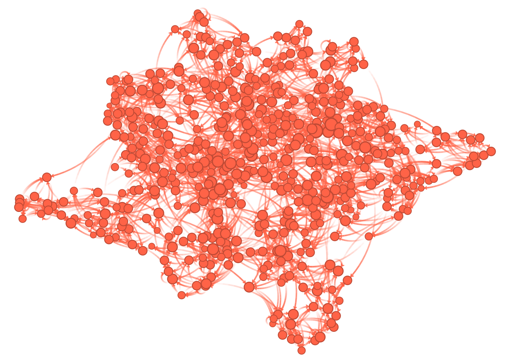
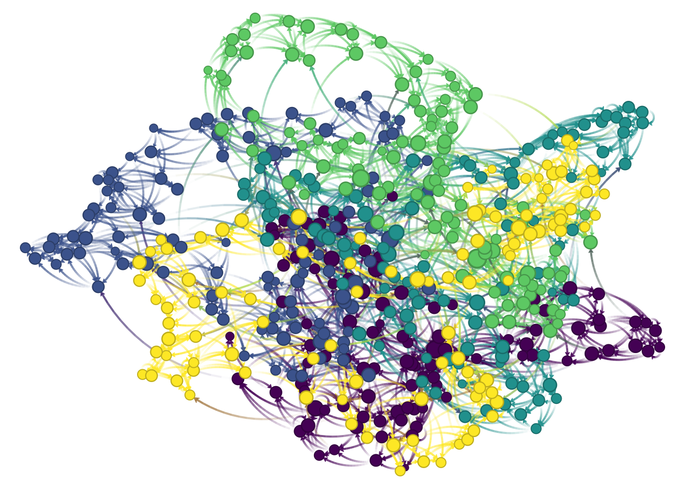
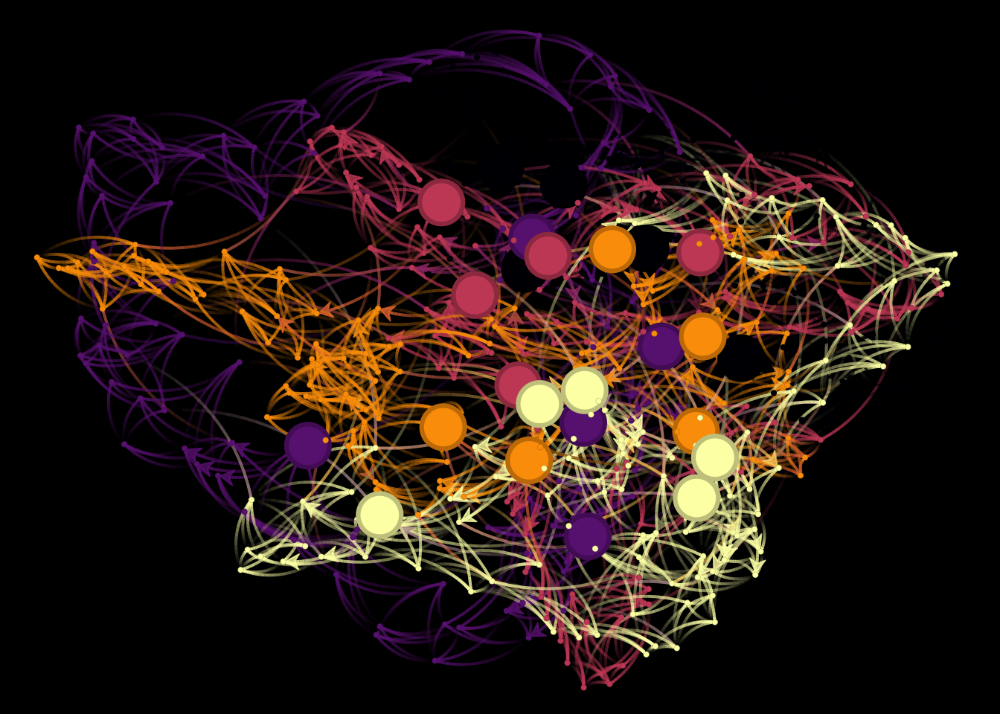

---
title: "rank"
author: "George G. Vega Yon"
date: "May 4, 2018"
output: html_document
---


## R Markdown


```r
library(igraph)
```

```
## 
## Attaching package: 'igraph'
```

```
## The following objects are masked from 'package:stats':
## 
##     decompose, spectrum
```

```
## The following object is masked from 'package:base':
## 
##     union
```

```r
library(dplyr)
```

```
## 
## Attaching package: 'dplyr'
```

```
## The following objects are masked from 'package:igraph':
## 
##     as_data_frame, groups, union
```

```
## The following objects are masked from 'package:stats':
## 
##     filter, lag
```

```
## The following objects are masked from 'package:base':
## 
##     intersect, setdiff, setequal, union
```

```r
library(netplot)
```

```
## 
## Attaching package: 'netplot'
```

```
## The following object is masked from 'package:igraph':
## 
##     ego
```

```r
set.seed(1231)
n   <- 500
X   <- cbind(school = sort(rep(1:5, n/5)))
net <- sample_smallworld(1, n, 4, .05) 

nplot(net)
```



```r
col <- viridis::viridis(5)
col <- col[X]
nplot(net, vertex.color = col)
```



```r
# Adding X as an igraph attribute
V(net)$school <- X
```

Computing centrality measures


```r
V(net)$btw_cent <- betweenness(net, normalized = TRUE)
V(net)$ind_cent <- degree(net, mode="in")
```

Ranking


```r
dat              <- igraph::as_data_frame(net, what = "vertices")
dat              <- dplyr::as_tibble(dat)
dat$original_pos <- 1:nrow(dat)

dat  <- group_by(dat, school)

dat <- arrange(
  dat,
  -ind_cent,
  -btw_cent,
  .by_group = TRUE
)

dat <- mutate(
  dat,
  school_size = length(original_pos),
  pos         = 1:school_size,
  is_leader   = as.integer(pos <= (school_size*0.05))
  )
```

```
## Warning in 1:school_size: numerical expression has 100 elements: only the
## first used

## Warning in 1:school_size: numerical expression has 100 elements: only the
## first used

## Warning in 1:school_size: numerical expression has 100 elements: only the
## first used

## Warning in 1:school_size: numerical expression has 100 elements: only the
## first used

## Warning in 1:school_size: numerical expression has 100 elements: only the
## first used
```

```r
dat <- arrange(
  dat,
  original_pos
)

library(magrittr)

group_by(dat, school) %>%
  arrange(
    -ind_cent,
    -btw_cent,
    .by_group=TRUE) %>%
  mutate(
    pos         = 1:school_size,
    is_leader   = as.integer(pos <= (school_size*.05) )
  ) %>%
  arrange(original_pos) %>%
  View
```

```
## Warning in 1:school_size: numerical expression has 100 elements: only the
## first used

## Warning in 1:school_size: numerical expression has 100 elements: only the
## first used

## Warning in 1:school_size: numerical expression has 100 elements: only the
## first used

## Warning in 1:school_size: numerical expression has 100 elements: only the
## first used

## Warning in 1:school_size: numerical expression has 100 elements: only the
## first used
```

```r
# In stata, group by: _N, this is equivalent to n() in dplyr
by(dat, dat$school, function(x) rank(x$ind_cent))
```

```
## dat$school: 1
##   [1]  17.0  17.0  17.0  52.5   1.5   3.5  17.0  17.0  52.5  17.0  85.5
##  [12]  52.5  52.5  52.5  52.5  52.5  85.5  52.5  17.0  52.5  52.5  85.5
##  [23]  97.5  52.5  97.5  85.5  85.5  52.5  17.0  17.0  85.5  52.5  52.5
##  [34]  17.0  52.5  52.5  52.5   1.5  52.5  85.5  85.5  17.0  17.0  97.5
##  [45]  52.5  85.5  17.0  52.5  52.5  17.0   3.5  52.5  52.5  52.5  17.0
##  [56]  85.5  52.5  85.5  52.5  52.5  52.5  52.5  52.5  17.0  85.5  17.0
##  [67] 100.0  52.5  17.0  52.5  52.5  85.5  52.5  85.5  52.5  52.5  52.5
##  [78]  17.0  52.5  17.0  85.5  52.5  52.5  85.5  52.5  85.5  52.5  17.0
##  [89]  52.5  17.0  85.5  17.0  85.5  52.5  97.5  52.5  85.5  17.0  52.5
## [100]  17.0
## -------------------------------------------------------- 
## dat$school: 2
##   [1]  90.0  18.0   3.5   3.5  90.0  18.0  57.0  18.0  97.5  57.0  18.0
##  [12]  57.0  57.0  57.0  18.0  97.5  18.0  57.0  57.0  57.0  90.0  57.0
##  [23]  57.0  57.0  57.0  57.0 100.0  57.0  57.0  57.0  18.0  57.0  18.0
##  [34]  18.0  18.0  18.0  57.0  18.0  18.0  90.0  57.0  57.0  57.0  97.5
##  [45]  57.0  57.0  57.0  57.0  57.0   3.5  57.0   3.5  18.0  57.0  90.0
##  [56]  57.0  18.0  18.0  18.0  57.0  18.0  57.0  57.0  57.0  57.0  57.0
##  [67]  57.0  57.0  57.0  57.0  18.0  57.0  18.0  57.0  90.0  57.0  90.0
##  [78]  57.0   3.5   3.5  57.0  57.0  57.0  57.0  57.0  57.0  57.0  90.0
##  [89]  18.0  18.0  57.0  57.0  57.0  90.0  57.0  57.0  18.0  90.0  90.0
## [100]  97.5
## -------------------------------------------------------- 
## dat$school: 3
##   [1] 49.0  3.0 85.0 85.0 15.0 49.0 85.0 49.0 49.0 98.5 49.0 15.0 85.0 49.0
##  [15] 85.0 49.0 49.0 85.0 15.0 49.0 85.0 85.0 85.0 98.5 49.0 49.0 15.0 85.0
##  [29] 85.0 98.5 49.0 85.0 85.0  3.0 85.0 85.0 49.0  3.0 49.0 85.0 15.0 49.0
##  [43] 49.0 85.0 15.0 49.0 49.0 49.0 49.0 49.0 15.0 49.0 15.0 15.0 85.0 49.0
##  [57] 49.0 15.0 15.0 49.0 85.0 98.5 49.0 85.0 49.0 85.0 15.0 49.0 49.0 15.0
##  [71] 85.0 49.0 15.0 15.0 49.0 49.0 49.0 49.0 49.0 49.0 49.0 49.0 49.0 49.0
##  [85] 49.0 49.0 49.0 49.0  3.0 15.0 15.0 49.0 49.0 49.0  3.0 15.0 15.0 85.0
##  [99] 49.0 49.0
## -------------------------------------------------------- 
## dat$school: 4
##   [1]  14.0  46.0  46.0  46.0 100.0  46.0  46.0  14.0  46.0  14.0  46.0
##  [12]  81.0  81.0  81.0  96.5  46.0  14.0  14.0  81.0  81.0  46.0  46.0
##  [23]  96.5  81.0  81.0  14.0  81.0  46.0  46.0  81.0  46.0  96.5  81.0
##  [34]   2.0  81.0  81.0  46.0  46.0  14.0  81.0  46.0  14.0  14.0  46.0
##  [45]  99.0  14.0  46.0  14.0  81.0  46.0  46.0  81.0   2.0  46.0  14.0
##  [56]  46.0  46.0  46.0  81.0  14.0  46.0  46.0  81.0  81.0  46.0  46.0
##  [67]  81.0  46.0  46.0  81.0  14.0  46.0  14.0  81.0  81.0  14.0  81.0
##  [78]  46.0  46.0  46.0  14.0  14.0  81.0  14.0  46.0  96.5  46.0  46.0
##  [89]  46.0  46.0  81.0  46.0  46.0   2.0  81.0  46.0  46.0  14.0  14.0
## [100]  81.0
## -------------------------------------------------------- 
## dat$school: 5
##   [1] 14.5 51.0 14.5 86.5 51.0 86.5 51.0 98.5 51.0 51.0 86.5 51.0 14.5 51.0
##  [15] 51.0 51.0 86.5 14.5  2.0 51.0 14.5 51.0 14.5 14.5  2.0  2.0 14.5 98.5
##  [29] 51.0 51.0 86.5 51.0 14.5 51.0 14.5 86.5 51.0 14.5 98.5 51.0 51.0 51.0
##  [43] 51.0 51.0 51.0 98.5 86.5 86.5 51.0 14.5 51.0 14.5 86.5 51.0 86.5 51.0
##  [57] 14.5 51.0 51.0 51.0 51.0 86.5 14.5 51.0 14.5 51.0 14.5 51.0 51.0 51.0
##  [71] 14.5 86.5 51.0 51.0 51.0 51.0 86.5 14.5 86.5 51.0 51.0 86.5 86.5 14.5
##  [85] 51.0 14.5 51.0 14.5 51.0 51.0 86.5 86.5 51.0 86.5 51.0 51.0 51.0 51.0
##  [99] 86.5 51.0
```

Taggin the leaders in igraph


```r
V(net)$is_leader <- dat$is_leader
```

Visualizing with netwplot


```r
is_leader_1_2 <- V(net)$is_leader + 1
nplot(
  net,
  vertex.size       = c(1, 2)[is_leader_1_2],
  vertex.size.range = c(.005, .05),
  vertex.color      = viridis::inferno(5)[V(net)$school],
  bg.col            = "black"
)
```




Example matching positions names in igraph


```r
# Creating a ring
x <- make_ring(5)
V(x)$name <- letters[1:5]

# Processing data
set.seed(123)
dat <- igraph::as_data_frame(x, what = "vertices")
dat$dummy <- runif(5) > .5
dat <- dat[order(runif(5)),,drop=FALSE] # Changed the sorting!

V(x)$name
```

```
## [1] "a" "b" "c" "d" "e"
```

```r
# Getting the original position
ord <- match(
  V(x)$name,
  dat$name
)

dat <- dat[ord,,drop=FALSE]

V(x)$new_dummy <- dat$dummy
```


