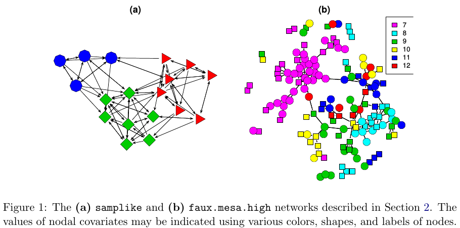

# Exponential Random Graph Models

I strongly suggest reading the vignette included in the `ergm` R package


```r
vignette("ergm", package="ergm")
```

> The purpose of ERGMs, in a nutshell, is to describe parsimoniously the local selection forces that shape the global structure of a network. To this end, a network dataset, like those depicted in Figure 1, may be considered as the response in a regression model, where the predictors are things like "propensity for individuals of the same sex to form partnerships" or "propensity for individuals to form triangles of partnerships". In Figure 1(b), for example, it is evident that the individual nodes appear to cluster in groups of the same numerical labels (which turn out to be students' grades, 7 through 12); thus, an ERGM can help us quantify the strength of this intra-group effect.  
>
> --- [@Hunter2008]



In a nutshell, we use ERGMs as a parametric interpretation of the distribution of $\mathbf{Y}$, which takes the canonical form:

$$
\Pr{\mathbf{Y}=\mathbf{y}|\theta, \mathcal{Y}} = \frac{\exp{\theta^{\mbox{T}}\mathbf{g}(\mathbf{y})}}{\kappa\left(\theta, \mathcal{Y}\right)},\quad\mathbf{y}\in\mathcal{Y}
(\#eq:04-1)
$$

Where $\theta\in\Omega\subset\mathbb{R}^q$ is the vector of model coefficients and $\mathbf{g}(\mathbf{y})$ is a *q*-vector of statistics based on the adjacency matrix $\mathbf{y}$.

Model \@ref(eq:04-1) may be expanded by replacing $\mathbf{g}(\mathbf{y})$ with $\mathbf{g}(\mathbf{y}, \mathbf{X})$ to allow for additional covariate information $\mathbf{X}$ about the network. The denominator,


$$
\kappa\left(\theta,\mathcal{Y}\right) = \sum_{\mathbf{y}\in\mathcal{Y}}\exp{\theta^{\mbox{T}}\mathbf{g}(\mathbf{y})}
$$

,is the normalizing factor that ensures that equation \@ref(eq:04-1) is a legitimate probability distribution. Even after fixing $\mathcal{Y}$ to be all the networks that have size $n$, the size of $\mathcal{Y}$ makes this type of statistical model hard to estimate as there are $N = 2^{n(n-1)}$ possible networks! [@Hunter2008]

Recent developments include new forms of dependency structures to take into account more general neighborhood effects. These models relax the one-step Markovian dependence assumptions, allowing investigation of longer-range configurations, such as longer paths in the network or larger cycles (Pattison and Robins 2002). Models for bipartite (Faust and Skvoretz 1999) and tripartite (Mische and Robins 2000) network structures have been developed. [@Hunter2008 p. 9]

## A naïve example

In the simplest case, ERGMs equate a logistic regression. By simple, I mean cases in which there are no Markovian terms--motifs involving more than one edge--for example, the Bernoulli graph. In the Bernoulli graph, ties are independent of each other, so the presence/absence of a tie between nodes $i$ and $j$ won't affect the presence/absence of a tie between nodes $k$ and $l$.

Let's fit an ERGM using the `sampson` dataset included in the `ergm` package.


```r
library(ergm)
data("sampson")
samplike
##  Network attributes:
##   vertices = 18 
##   directed = TRUE 
##   hyper = FALSE 
##   loops = FALSE 
##   multiple = FALSE 
##   total edges= 88 
##     missing edges= 0 
##     non-missing edges= 88 
## 
##  Vertex attribute names: 
##     cloisterville group vertex.names 
## 
##  Edge attribute names: 
##     nominations
```

Using `ergm` to fit a Bernoulli graph requires using the `edges` term, which counts how many ties are in the graph:


```r
ergm_fit <- ergm(samplike ~ edges)
## Starting maximum pseudolikelihood estimation (MPLE):
## Evaluating the predictor and response matrix.
## Maximizing the pseudolikelihood.
## Finished MPLE.
## Stopping at the initial estimate.
## Evaluating log-likelihood at the estimate.
```

Since this is equivalent to a logistic regression, we can use the `glm` function to fit the same model. First, we need to prepare the data so we can pass it to `glm`:


```r
y <- sort(as.vector(as.matrix(samplike)))
y <- y[-c(1:18)] # We remove the diagonal from the model, which is all 0.
y
##   [1] 0 0 0 0 0 0 0 0 0 0 0 0 0 0 0 0 0 0 0 0 0 0 0 0 0 0 0 0 0 0 0 0 0 0 0 0 0
##  [38] 0 0 0 0 0 0 0 0 0 0 0 0 0 0 0 0 0 0 0 0 0 0 0 0 0 0 0 0 0 0 0 0 0 0 0 0 0
##  [75] 0 0 0 0 0 0 0 0 0 0 0 0 0 0 0 0 0 0 0 0 0 0 0 0 0 0 0 0 0 0 0 0 0 0 0 0 0
## [112] 0 0 0 0 0 0 0 0 0 0 0 0 0 0 0 0 0 0 0 0 0 0 0 0 0 0 0 0 0 0 0 0 0 0 0 0 0
## [149] 0 0 0 0 0 0 0 0 0 0 0 0 0 0 0 0 0 0 0 0 0 0 0 0 0 0 0 0 0 0 0 0 0 0 0 0 0
## [186] 0 0 0 0 0 0 0 0 0 0 0 0 0 0 0 0 0 0 0 0 0 0 0 0 0 0 0 0 0 0 0 0 0 1 1 1 1
## [223] 1 1 1 1 1 1 1 1 1 1 1 1 1 1 1 1 1 1 1 1 1 1 1 1 1 1 1 1 1 1 1 1 1 1 1 1 1
## [260] 1 1 1 1 1 1 1 1 1 1 1 1 1 1 1 1 1 1 1 1 1 1 1 1 1 1 1 1 1 1 1 1 1 1 1 1 1
## [297] 1 1 1 1 1 1 1 1 1 1
```

We can now fit the GLM model:


```r
glm_fit <- glm(y~1, family=binomial("logit"))
```

The coefficients of both ERGM and GLM should match:


```r
glm_fit
## 
## Call:  glm(formula = y ~ 1, family = binomial("logit"))
## 
## Coefficients:
## (Intercept)  
##     -0.9072  
## 
## Degrees of Freedom: 305 Total (i.e. Null);  305 Residual
## Null Deviance:	    367.2 
## Residual Deviance: 367.2 	AIC: 369.2
ergm_fit
## 
## Call:
## ergm(formula = samplike ~ edges)
## 
## Maximum Likelihood Coefficients:
##   edges  
## -0.9072
```

Furthermore, in the case of the Bernoulli graph, we can get the estimate using the Logit function:


```r
pr <- mean(y)
# Logit function:
# Alternatively we could have used log(pr) - log(1-pr)
qlogis(pr)
## [1] -0.9071582
```

Again, the same result. The Bernoulli graph is not the only ERGM model that can be fitted using a Logistic regression. Moreover, if all the terms of the model are non-Markov terms, `ergm` automatically defaults to a Logistic regression.

## Estimation of ERGMs

The ultimate goal is to perform statistical inference on the proposed model. In a *standard* setting, we would be able to use Maximum-Likelihood-Estimation (MLE), which consists of finding the model parameters $\theta$ that, given the observed data, maximize the likelihood of the model. For the latter, we generally use [Newton's method](https://en.wikipedia.org/wiki/Newton%27s_method_in_optimization). Newton's method requires been able to compute the log-likelihood of the model, which in ERGMs can be challenging.

For ERGMs, since part of the likelihood involves a normalizing constant that is a function of all possible networks, this is not as straightforward as in the regular setting. Because of it, most estimation methods rely on simulations.

In `statnet`, the default estimation method is based on a method proposed by [@Geyer1992], Markov-Chain MLE, which uses Markov-Chain Monte Carlo for simulating networks and a modified version of the Newton-Raphson algorithm to estimate the parameters.

The idea of MC-MLE for this family of statistical models is that we can approximate the expectation of normalizing constant ratios using the law of large numbers. In particular, the following:

\begin{align*}
\frac{\kappa\left(\theta,\mathcal{Y}\right)}{\kappa\left(\theta_0,\mathcal{Y}\right)} & = 
  \frac{
    \sum_{\mathbf{y}\in\mathcal{Y}}\exp{\theta^{\mbox{T}}\mathbf{g}(\mathbf{y})}}{ 
    \sum_{\mathbf{y}\in\mathcal{Y}}\exp{\theta_0^{\mbox{T}}\mathbf{g}(\mathbf{y})} 
  } \\
& = \sum_{\mathbf{y}\in\mathcal{Y}}\left( %
  \frac{1}{%
    \sum_{\mathbf{y}\in\mathcal{Y}\exp{\theta_0^{\mbox{T}}\mathbf{g}(\mathbf{y})}}%
  } \times %
  \exp{\theta^{\mbox{T}}\mathbf{g}(\mathbf{y})} %
  \right) \\
& = \sum_{\mathbf{y}\in\mathcal{Y}}\left( %
  \frac{\exp{\theta_0^{\mbox{T}}\mathbf{g}(\mathbf{y})}}{%
    \sum_{\mathbf{y}\in\mathcal{Y}\exp{\theta_0^{\mbox{T}}\mathbf{g}(\mathbf{y})}}%
  } \times %
  \exp{(\theta - \theta_0)^{\mbox{T}}\mathbf{g}(\mathbf{y})} %
  \right) \\
& = \sum_{\mathbf{y}\in\mathcal{Y}}\left( %
  \Pr{Y = y|\mathcal{Y}, \theta_0} \times %
  \exp{(\theta - \theta_0)^{\mbox{T}}\mathbf{g}(\mathbf{y})} %
  \right) \\
& = \mbox{E}_{\theta_0}\left(\exp{(\theta - \theta_0)^{\mbox{T}}\mathbf{g}(\mathbf{y})} \right)
\end{align*}

In particular, the MC-MLE algorithm uses this fact to maximize the ratio of log-likelihoods. The objective function itself can be approximated by simulating $m$ networks from the distribution with parameter $\theta_0$:

$$
l(\theta) - l(\theta_0) \approx (\theta - \theta_0)^{\mbox{T}}\mathbf{g}(\mathbf{y}_{obs}) - 
\mbox{log}{\left[\frac{1}{m}\sum_{i = 1}^m\exp{(\theta-\theta_0)^{\mbox{T}}}\mathbf{g}(\mathbf{Y}_i)\right]}
$$

For more details, see [@Hunter2008]. A sketch of the algorithm follows:

1.  Initialize the algorithm with an initial guess of $\theta$, call it $\theta^{(t)}$ (must be a rather OK guess)

2.  While (no convergence) do:
    
    a.  Using $\theta^{(t)}$, simulate $M$ networks by means of small changes in the $\mathbf{Y}_{obs}$ (the observed network). This part is done by using an importance-sampling method which weights each proposed network by its likelihood conditional on $\theta^{(t)}$
    
    b.  With the networks simulated, we can do the Newton step to update the parameter $\theta^{(t)}$ (this is the iteration part in the `ergm` package): $\theta^{(t)}\to\theta^{(t+1)}$.
    
    c.  If convergence has been reached (which usually means that $\theta^{(t)}$ and $\theta^{(t + 1)}$ are not very different), then stop; otherwise, go to step a.

For more details see [@lusher2012;@admiraal2006;@Snijders2002;@Wang2009] provides details on the algorithm used by PNet (which is the same as the one used in `RSiena`). [@lusher2012] provides a short discussion on the differences between `ergm` and `PNet`. 


## The `ergm` package

The `ergm` R package [@R-ergm]

From the previous section:^[You can download the 03.rda file from [this link](https://github.com/gvegayon/appliedsnar).]


```r
library(igraph)
library(magrittr)
library(dplyr)

load("03.rda")
```


In this section, we will use the `ergm` package (from the `statnet` suit of packages [@R-statnet],) and the `intergraph` [@R-intergraph] package. The latter provides functions to go back and forth between `igraph` and `network` objects from the `igraph` and `network` packages respectively^[Yes, the classes have the same name as the packages.]


```r
library(ergm)
library(intergraph)
```

As a rather important side note, the order in which R packages are loaded matters. Why is this important to mention now? Well, it turns out that at least a couple of functions in the `network` package have the same name as some functions in the `igraph` package. When the `ergm` package is loaded, since it depends on `network`, it will load the `network`  package first, which will _mask_ some functions in `igraph`. This becomes evident once you load `ergm` after loading `igraph`:
  
```
The following objects are masked from ‘package:igraph’:

  add.edges, add.vertices, %c%, delete.edges, delete.vertices, get.edge.attribute, get.edges,
  get.vertex.attribute, is.bipartite, is.directed, list.edge.attributes, list.vertex.attributes, %s%,
  set.edge.attribute, set.vertex.attribute
```

What are the implications of this? If you call the function `list.edge.attributes` for an object of class `igraph` R will return an error as the first function that matches that name comes from the `network` package! To avoid this you can use the double colon notation:

```r
igraph::list.edge.attributes(my_igraph_object)
network::list.edge.attributes(my_network_object)
```

Anyway... Using the `asNetwork` function, we can coerce the `igraph` object into a network object so we can use it with the `ergm` function:


```r
# Creating the new network
network_111 <- intergraph::asNetwork(ig_year1_111)

# Running a simple ergm (only fitting edge count)
ergm(network_111 ~ edges)
## [1] "Warning:  This network contains loops"
## Starting maximum pseudolikelihood estimation (MPLE):
## Evaluating the predictor and response matrix.
## Maximizing the pseudolikelihood.
## Finished MPLE.
## Stopping at the initial estimate.
## Evaluating log-likelihood at the estimate.
## 
## Call:
## ergm(formula = network_111 ~ edges)
## 
## Maximum Likelihood Coefficients:
##  edges  
## -4.734
```

So what happened here? We got a warning. It turns out that our network has loops (didn't think about it before!). Let's take a look at that with the `which_loop` function


```r
E(ig_year1_111)[which_loop(ig_year1_111)]
## + 1/2638 edge from 999398d (vertex names):
## [1] 1110111->1110111
```

We can get rid of these using the `igraph::-.igraph`. Let's remove the isolates using the same operator


```r
# Creating the new network
network_111 <- ig_year1_111

# Removing loops
network_111 <- network_111 - E(network_111)[which(which_loop(network_111))]

# Removing isolates
network_111 <- network_111 - which(degree(network_111, mode = "all") == 0)

# Converting the network
network_111 <- intergraph::asNetwork(network_111)
```


`asNetwork(simplify(ig_year1_111))`
`ig_year1_111 %>% simplify %>% asNetwork`

A problem that we have with this data is the fact that some vertices have missing values in the variables `hispanic`, `female1`, and `eversmk1`. For now, we will proceed by imputing values based on the averages:


```r
for (v in c("hispanic", "female1", "eversmk1")) {
  tmpv <- network_111 %v% v
  tmpv[is.na(tmpv)] <- mean(tmpv, na.rm = TRUE) > .5
  network_111 %v% v <- tmpv
}
```


## Running ERGMs

Proposed workflow:

1.  Estimate the simplest model, adding one variable at a time.

2.  After each estimation, run the `mcmc.diagnostics` function to see how good (or bad) behaved the chains are.

3.  Run the `gof` function and verify how good the model matches the network's structural statistics.

What to use:

1.  `control.ergms`: Maximum number of iterations, seed for Pseudo-RNG, how many cores

2.  `ergm.constraints`: Where to sample the network from. Gives stability and (in some cases) faster convergence as by constraining the model you are reducing the sample size.

Here is an example of a couple of models that we could compare^[Notice that this document may not include the usual messages that the `ergm` command generates during the estimation procedure. This is just to make it more printable-friendly.]


```r
ans0 <- ergm(
  network_111 ~
    edges +
    nodematch("hispanic") +
    nodematch("female1") +
    nodematch("eversmk1") +
    mutual
    ,
  constraints = ~bd(maxout = 19),
  control = control.ergm(
    seed        = 1,
    MCMLE.maxit = 10,
    parallel    = 4,
    CD.maxit    = 10
    )
  )
```

So what are we doing here:

1.  The model is controlling for: 
    
    a.  `edges` Number of edges in the network (as opposed to its density)
    
    b.  `nodematch("some-variable-name-here")` Includes a term that controls for homophily/heterophily
    
    c.  `mutual` Number of mutual connections between $(i, j), (j, i)$. This can be related to, for example, triadic closure.
    
For more on control parameters, see [@Morris2008].


```r
ans1 <- ergm(
  network_111 ~
    edges +
    nodematch("hispanic") +
    nodematch("female1") +
    nodematch("eversmk1")
    ,
  constraints = ~bd(maxout = 19),
  control = control.ergm(
    seed        = 1,
    MCMLE.maxit = 10,
    parallel    = 4,
    CD.maxit    = 10
    )
  )
```

This example takes longer to compute


```r
ans2 <- ergm(
  network_111 ~
    edges +
    nodematch("hispanic") +
    nodematch("female1") +
    nodematch("eversmk1") + 
    mutual +
    balance
    ,
  constraints = ~bd(maxout = 19),
  control = control.ergm(
    seed        = 1,
    MCMLE.maxit = 10,
    parallel    = 4,
    CD.maxit    = 10
    )
  )
```

Now, a nice trick to see all regressions in the same table, we can use the `texreg` package [@R-texreg] which supports `ergm` ouputs!


```r
library(texreg)
screenreg(list(ans0, ans1, ans2))
## Warning: This object was fit with 'ergm' version 4.1.2 or earlier. Summarizing
## it with version 4.2 or later may return incorrect results or fail.
## Warning in nobs.ergm(object): The number of observed dyads in this network is
## ill-defined due to complex constraints on the sample space. Disable this warning
## with 'options(ergm.loglik.warn_dyads=FALSE)'.
## Warning: This object was fit with 'ergm' version 4.1.2 or earlier. Summarizing
## it with version 4.2 or later may return incorrect results or fail.
## Warning in nobs.ergm(object): The number of observed dyads in this network is
## ill-defined due to complex constraints on the sample space. Disable this warning
## with 'options(ergm.loglik.warn_dyads=FALSE)'.
## Warning: This object was fit with 'ergm' version 4.1.2 or earlier. Summarizing
## it with version 4.2 or later may return incorrect results or fail.
## Warning in nobs.ergm(object): The number of observed dyads in this network is
## ill-defined due to complex constraints on the sample space. Disable this warning
## with 'options(ergm.loglik.warn_dyads=FALSE)'.
## 
## ===============================================================
##                     Model 1        Model 2        Model 3      
## ---------------------------------------------------------------
## edges                   -5.63 ***      -5.49 ***      -5.60 ***
##                         (0.05)         (0.06)         (0.06)   
## nodematch.hispanic       0.22 ***       0.30 ***       0.22 ***
##                         (0.04)         (0.05)         (0.04)   
## nodematch.female1        0.87 ***       1.17 ***       0.87 ***
##                         (0.04)         (0.05)         (0.04)   
## nodematch.eversmk1       0.33 ***       0.45 ***       0.34 ***
##                         (0.04)         (0.04)         (0.04)   
## mutual                   4.10 ***                      1.75 ***
##                         (0.07)                        (0.14)   
## balance                                                0.01 ***
##                                                       (0.00)   
## ---------------------------------------------------------------
## AIC                 -40017.80      -37511.87      -39989.59    
## BIC                 -39967.46      -37471.60      -39929.18    
## Log Likelihood       20013.90       18759.94       20000.79    
## ===============================================================
## *** p < 0.001; ** p < 0.01; * p < 0.05
```

Or, if you are using rmarkdown, you can export the results using LaTeX or html, let's try the latter to see how it looks like here:


```r
library(texreg)
htmlreg(list(ans0, ans1, ans2))
## Warning: This object was fit with 'ergm' version 4.1.2 or earlier. Summarizing
## it with version 4.2 or later may return incorrect results or fail.
## Warning in nobs.ergm(object): The number of observed dyads in this network is
## ill-defined due to complex constraints on the sample space. Disable this warning
## with 'options(ergm.loglik.warn_dyads=FALSE)'.
## Warning: This object was fit with 'ergm' version 4.1.2 or earlier. Summarizing
## it with version 4.2 or later may return incorrect results or fail.
## Warning in nobs.ergm(object): The number of observed dyads in this network is
## ill-defined due to complex constraints on the sample space. Disable this warning
## with 'options(ergm.loglik.warn_dyads=FALSE)'.
## Warning: This object was fit with 'ergm' version 4.1.2 or earlier. Summarizing
## it with version 4.2 or later may return incorrect results or fail.
## Warning in nobs.ergm(object): The number of observed dyads in this network is
## ill-defined due to complex constraints on the sample space. Disable this warning
## with 'options(ergm.loglik.warn_dyads=FALSE)'.
```

<table class="texreg" style="margin: 10px auto;border-collapse: collapse;border-spacing: 0px;caption-side: bottom;color: #000000;border-top: 2px solid #000000;">
<caption>Statistical models</caption>
<thead>
<tr>
<th style="padding-left: 5px;padding-right: 5px;">&nbsp;</th>
<th style="padding-left: 5px;padding-right: 5px;">Model 1</th>
<th style="padding-left: 5px;padding-right: 5px;">Model 2</th>
<th style="padding-left: 5px;padding-right: 5px;">Model 3</th>
</tr>
</thead>
<tbody>
<tr style="border-top: 1px solid #000000;">
<td style="padding-left: 5px;padding-right: 5px;">edges</td>
<td style="padding-left: 5px;padding-right: 5px;">-5.63<sup>&#42;&#42;&#42;</sup></td>
<td style="padding-left: 5px;padding-right: 5px;">-5.49<sup>&#42;&#42;&#42;</sup></td>
<td style="padding-left: 5px;padding-right: 5px;">-5.60<sup>&#42;&#42;&#42;</sup></td>
</tr>
<tr>
<td style="padding-left: 5px;padding-right: 5px;">&nbsp;</td>
<td style="padding-left: 5px;padding-right: 5px;">(0.05)</td>
<td style="padding-left: 5px;padding-right: 5px;">(0.06)</td>
<td style="padding-left: 5px;padding-right: 5px;">(0.06)</td>
</tr>
<tr>
<td style="padding-left: 5px;padding-right: 5px;">nodematch.hispanic</td>
<td style="padding-left: 5px;padding-right: 5px;">0.22<sup>&#42;&#42;&#42;</sup></td>
<td style="padding-left: 5px;padding-right: 5px;">0.30<sup>&#42;&#42;&#42;</sup></td>
<td style="padding-left: 5px;padding-right: 5px;">0.22<sup>&#42;&#42;&#42;</sup></td>
</tr>
<tr>
<td style="padding-left: 5px;padding-right: 5px;">&nbsp;</td>
<td style="padding-left: 5px;padding-right: 5px;">(0.04)</td>
<td style="padding-left: 5px;padding-right: 5px;">(0.05)</td>
<td style="padding-left: 5px;padding-right: 5px;">(0.04)</td>
</tr>
<tr>
<td style="padding-left: 5px;padding-right: 5px;">nodematch.female1</td>
<td style="padding-left: 5px;padding-right: 5px;">0.87<sup>&#42;&#42;&#42;</sup></td>
<td style="padding-left: 5px;padding-right: 5px;">1.17<sup>&#42;&#42;&#42;</sup></td>
<td style="padding-left: 5px;padding-right: 5px;">0.87<sup>&#42;&#42;&#42;</sup></td>
</tr>
<tr>
<td style="padding-left: 5px;padding-right: 5px;">&nbsp;</td>
<td style="padding-left: 5px;padding-right: 5px;">(0.04)</td>
<td style="padding-left: 5px;padding-right: 5px;">(0.05)</td>
<td style="padding-left: 5px;padding-right: 5px;">(0.04)</td>
</tr>
<tr>
<td style="padding-left: 5px;padding-right: 5px;">nodematch.eversmk1</td>
<td style="padding-left: 5px;padding-right: 5px;">0.33<sup>&#42;&#42;&#42;</sup></td>
<td style="padding-left: 5px;padding-right: 5px;">0.45<sup>&#42;&#42;&#42;</sup></td>
<td style="padding-left: 5px;padding-right: 5px;">0.34<sup>&#42;&#42;&#42;</sup></td>
</tr>
<tr>
<td style="padding-left: 5px;padding-right: 5px;">&nbsp;</td>
<td style="padding-left: 5px;padding-right: 5px;">(0.04)</td>
<td style="padding-left: 5px;padding-right: 5px;">(0.04)</td>
<td style="padding-left: 5px;padding-right: 5px;">(0.04)</td>
</tr>
<tr>
<td style="padding-left: 5px;padding-right: 5px;">mutual</td>
<td style="padding-left: 5px;padding-right: 5px;">4.10<sup>&#42;&#42;&#42;</sup></td>
<td style="padding-left: 5px;padding-right: 5px;">&nbsp;</td>
<td style="padding-left: 5px;padding-right: 5px;">1.75<sup>&#42;&#42;&#42;</sup></td>
</tr>
<tr>
<td style="padding-left: 5px;padding-right: 5px;">&nbsp;</td>
<td style="padding-left: 5px;padding-right: 5px;">(0.07)</td>
<td style="padding-left: 5px;padding-right: 5px;">&nbsp;</td>
<td style="padding-left: 5px;padding-right: 5px;">(0.14)</td>
</tr>
<tr>
<td style="padding-left: 5px;padding-right: 5px;">balance</td>
<td style="padding-left: 5px;padding-right: 5px;">&nbsp;</td>
<td style="padding-left: 5px;padding-right: 5px;">&nbsp;</td>
<td style="padding-left: 5px;padding-right: 5px;">0.01<sup>&#42;&#42;&#42;</sup></td>
</tr>
<tr>
<td style="padding-left: 5px;padding-right: 5px;">&nbsp;</td>
<td style="padding-left: 5px;padding-right: 5px;">&nbsp;</td>
<td style="padding-left: 5px;padding-right: 5px;">&nbsp;</td>
<td style="padding-left: 5px;padding-right: 5px;">(0.00)</td>
</tr>
<tr style="border-top: 1px solid #000000;">
<td style="padding-left: 5px;padding-right: 5px;">AIC</td>
<td style="padding-left: 5px;padding-right: 5px;">-40017.80</td>
<td style="padding-left: 5px;padding-right: 5px;">-37511.87</td>
<td style="padding-left: 5px;padding-right: 5px;">-39989.59</td>
</tr>
<tr>
<td style="padding-left: 5px;padding-right: 5px;">BIC</td>
<td style="padding-left: 5px;padding-right: 5px;">-39967.46</td>
<td style="padding-left: 5px;padding-right: 5px;">-37471.60</td>
<td style="padding-left: 5px;padding-right: 5px;">-39929.18</td>
</tr>
<tr style="border-bottom: 2px solid #000000;">
<td style="padding-left: 5px;padding-right: 5px;">Log Likelihood</td>
<td style="padding-left: 5px;padding-right: 5px;">20013.90</td>
<td style="padding-left: 5px;padding-right: 5px;">18759.94</td>
<td style="padding-left: 5px;padding-right: 5px;">20000.79</td>
</tr>
</tbody>
<tfoot>
<tr>
<td style="font-size: 0.8em;" colspan="4"><sup>&#42;&#42;&#42;</sup>p &lt; 0.001; <sup>&#42;&#42;</sup>p &lt; 0.01; <sup>&#42;</sup>p &lt; 0.05</td>
</tr>
</tfoot>
</table>


## Model Goodness-of-Fit

In raw terms, once each chain has reach stationary distribution, we can say that there are no problems with autocorrelation and that each sample point is iid. This implies that, since we are running the model with more than 1 chain, we can use all the samples (chains) as a single dataset.

> Recent changes in the ergm estimation algorithm mean that these plots can no longer be used to ensure that the mean statistics from the model match the observed network statistics. For that functionality, please use the GOF command: gof(object, GOF=~model).
>
> ---?ergm::mcmc.diagnostics

Since `ans0` is the one model which did best, let's take a look at it's GOF statistics. First, lets see how the MCMC did. For this we can use the `mcmc.diagnostics` function including in the package. This function is actually a wrapper of a couple of functions from the `coda` package [@R-coda] which is called upon the `$sample` object which holds the *centered* statistics from the sampled networks. This last point is important to consider since at first look it can be confusing to look at the `$sample` object since it neither matches the observed statistics, nor the coefficients. 

When calling the function `mcmc.diagnostics(ans0, centered = FALSE)`, you will see a lot of output including a couple of plots showing the trace and posterior distribution of the *uncentered* statistics (`centered = FALSE`). In the next code chunks we will reproduce the output from the `mcmc.diagnostics` function step by step using the coda package. First we need to *uncenter* the sample object:


```r
# Getting the centered sample
sample_centered <- ans0$sample

# Getting the observed statistics and turning it into a matrix so we can add it
# to the samples
observed <- summary(ans0$formula)
observed <- matrix(
  observed,
  nrow  = nrow(sample_centered[[1]]),
  ncol  = length(observed),
  byrow = TRUE
  )

# Now we uncenter the sample
sample_uncentered <- lapply(sample_centered, function(x) {
  x + observed
})

# We have to make it an mcmc.list object
sample_uncentered <- coda::mcmc.list(sample_uncentered)
```

Under the hood:

1.  _Empirical means and sd, and quantiles_: 
    
    ```r
    summary(sample_uncentered)
    ## 
    ## Iterations = 1769472:10944512
    ## Thinning interval = 65536 
    ## Number of chains = 4 
    ## Sample size per chain = 141 
    ## 
    ## 1. Empirical mean and standard deviation for each variable,
    ##    plus standard error of the mean:
    ## 
    ##                    Mean    SD Naive SE Time-series SE
    ## edges              2485 60.26   2.5372          3.753
    ## nodematch.hispanic 1838 51.25   2.1578          3.662
    ## nodematch.female1  1888 52.78   2.2224          3.779
    ## nodematch.eversmk1 1759 50.82   2.1400          3.072
    ## mutual              493 23.40   0.9855          1.967
    ## 
    ## 2. Quantiles for each variable:
    ## 
    ##                    2.5%  25%  50%  75% 97.5%
    ## edges              2373 2444 2482 2530  2612
    ## nodematch.hispanic 1736 1803 1839 1872  1947
    ## nodematch.female1  1791 1851 1885 1923  1993
    ## nodematch.eversmk1 1662 1725 1758 1794  1858
    ## mutual              449  476  493  509   537
    ```
2.  _Cross correlation_: 
    
    ```r
    coda::crosscorr(sample_uncentered)
    ##                        edges nodematch.hispanic nodematch.female1
    ## edges              1.0000000          0.8657369         0.8851587
    ## nodematch.hispanic 0.8657369          1.0000000         0.7713632
    ## nodematch.female1  0.8851587          0.7713632         1.0000000
    ## nodematch.eversmk1 0.8445651          0.7122693         0.7572735
    ## mutual             0.7726517          0.6801783         0.7482026
    ##                    nodematch.eversmk1    mutual
    ## edges                       0.8445651 0.7726517
    ## nodematch.hispanic          0.7122693 0.6801783
    ## nodematch.female1           0.7572735 0.7482026
    ## nodematch.eversmk1          1.0000000 0.6873242
    ## mutual                      0.6873242 1.0000000
    ```
3.  _Autocorrelation_: For now, we will only look at autocorrelation for chain one. Autocorrelation should be small (in a general MCMC setting). If autocorrelation is high, then it means that your sample is not idd (no Markov property). A way out to solve this is *thinning* the sample.
    
    ```r
    coda::autocorr(sample_uncentered)[[1]]
    ## , , edges
    ## 
    ##                   edges nodematch.hispanic nodematch.female1 nodematch.eversmk1
    ## Lag 0       1.000000000        0.861920590        0.90235072         0.86215333
    ## Lag 65536   0.415060923        0.326775063        0.43751588         0.38274418
    ## Lag 327680  0.063993999        0.002238453        0.09094189         0.05143792
    ## Lag 655360  0.002497326       -0.105210070       -0.02414091         0.00143358
    ## Lag 3276800 0.026845190        0.068616366        0.03686125         0.03652383
    ##                  mutual
    ## Lag 0       0.785264416
    ## Lag 65536   0.428519050
    ## Lag 327680  0.074020671
    ## Lag 655360  0.009422505
    ## Lag 3276800 0.018126669
    ## 
    ## , , nodematch.hispanic
    ## 
    ##                   edges nodematch.hispanic nodematch.female1 nodematch.eversmk1
    ## Lag 0        0.86192059        1.000000000        0.76137201         0.74623272
    ## Lag 65536    0.32680263        0.336764054        0.30353156         0.32690588
    ## Lag 327680   0.05778076        0.004465856        0.07267341         0.03757479
    ## Lag 655360   0.07704457        0.024226503        0.03252125         0.08420548
    ## Lag 3276800 -0.02970399        0.021278122       -0.02753467        -0.03018601
    ##                  mutual
    ## Lag 0        0.70578514
    ## Lag 65536    0.35558587
    ## Lag 327680   0.05282736
    ## Lag 655360   0.08176601
    ## Lag 3276800 -0.07743174
    ## 
    ## , , nodematch.female1
    ## 
    ##                   edges nodematch.hispanic nodematch.female1 nodematch.eversmk1
    ## Lag 0       0.902350724         0.76137201        1.00000000         0.77769826
    ## Lag 65536   0.453418914         0.37756721        0.51290498         0.41954866
    ## Lag 327680  0.055464012        -0.01058737        0.09841770         0.04272154
    ## Lag 655360  0.009910833        -0.06123858       -0.03186870         0.04679847
    ## Lag 3276800 0.004163166         0.04057544        0.01548719        -0.01288236
    ##                  mutual
    ## Lag 0        0.76981085
    ## Lag 65536    0.46327442
    ## Lag 327680   0.03629824
    ## Lag 655360   0.01987496
    ## Lag 3276800 -0.00949882
    ## 
    ## , , nodematch.eversmk1
    ## 
    ##                  edges nodematch.hispanic nodematch.female1 nodematch.eversmk1
    ## Lag 0       0.86215333        0.746232721        0.77769826        1.000000000
    ## Lag 65536   0.37539678        0.297591397        0.41717478        0.448697559
    ## Lag 327680  0.02105523       -0.040132752        0.03760486        0.019124328
    ## Lag 655360  0.04566425        0.003387581        0.04761067       -0.006388743
    ## Lag 3276800 0.05048735        0.084790008        0.07108989        0.045582057
    ##                   mutual
    ## Lag 0       0.7053009595
    ## Lag 65536   0.4020746950
    ## Lag 327680  0.0183308894
    ## Lag 655360  0.0840948296
    ## Lag 3276800 0.0009713556
    ## 
    ## , , mutual
    ## 
    ##                   edges nodematch.hispanic nodematch.female1 nodematch.eversmk1
    ## Lag 0        0.78526442         0.70578514       0.769810849         0.70530096
    ## Lag 65536    0.50645801         0.44741607       0.532817503         0.47751208
    ## Lag 327680   0.12979152         0.06061696       0.147380566         0.10930214
    ## Lag 655360  -0.06393205        -0.13217821      -0.008121728        -0.03814393
    ## Lag 3276800 -0.01707605         0.03244214      -0.023750630         0.02781638
    ##                   mutual
    ## Lag 0        1.000000000
    ## Lag 65536    0.580271013
    ## Lag 327680   0.091309576
    ## Lag 655360  -0.003521212
    ## Lag 3276800 -0.025558756
    ```
4.  _Geweke Diagnostic_: From the function's help file:
    
    > "If the samples are drawn from the stationary distribution of the chain, the two means are equal and Geweke's statistic has an asymptotically standard normal distribution. [...]
    The Z-score is calculated under the assumption that the two parts of the chain are asymptotically independent, which requires that the sum of frac1 and frac2 be strictly less than 1.""
    >
    > ---?coda::geweke.diag 
    
    Let's take a look at a single chain:
    
    
    ```r
    coda::geweke.diag(sample_uncentered)[[1]]
    ## 
    ## Fraction in 1st window = 0.1
    ## Fraction in 2nd window = 0.5 
    ## 
    ##              edges nodematch.hispanic  nodematch.female1 nodematch.eversmk1 
    ##            -0.7115            -1.7204            -0.1841             0.6952 
    ##             mutual 
    ##            -1.2891
    ```
5.  _(not included) Gelman Diagnostic_: From the function's help file:
    
    > Gelman and Rubin (1992) propose a general approach to monitoring convergence of MCMC output in which m > 1 parallel chains are run with starting values that are overdispersed relative to the posterior distribution. Convergence is diagnosed when the chains have ‘forgotten’ their initial values, and the output from all chains is indistinguishable. The gelman.diag diagnostic is applied to a single variable from the chain. It is based a comparison of within-chain and between-chain variances, and is similar to a classical analysis of variance.
    > ---?coda::gelman.diag
    
    As a difference from the previous diagnostic statistic, this uses all chains simulatenously:
    
    
    ```r
    coda::gelman.diag(sample_uncentered)
    ## Potential scale reduction factors:
    ## 
    ##                    Point est. Upper C.I.
    ## edges                    1.03       1.10
    ## nodematch.hispanic       1.03       1.10
    ## nodematch.female1        1.05       1.14
    ## nodematch.eversmk1       1.04       1.12
    ## mutual                   1.05       1.14
    ## 
    ## Multivariate psrf
    ## 
    ## 1.05
    ```
    
    As a rule of thumb, values that are in the $[.9,1.1]$ are good.
 
One nice feature of the `mcmc.diagnostics` function is the nice trace and posterior distribution plots that it generates. If you have the R package `latticeExtra` [@R-latticeExtra], the function will override the default plots used by `coda::plot.mcmc` and use lattice instead, creating a nicer looking plots. The next code chunk calls the `mcmc.diagnostic` function, but we suppress the rest of the output (see figure \@ref(fig:coda-plots)).


```r
# [2022-03-13] This line is failing for what it could be an ergm bug
# mcmc.diagnostics(ans0, center = FALSE) # Suppressing all the output
```


If we called the function `mcmc.diagnostics`, this message appears at the end:

>
MCMC diagnostics shown here are from the last round of simulation, prior to computation of final parameter estimates. Because the final estimates are refinements of those used for this simulation run, these diagnostics may understate model performance. To directly assess the performance of the final model on in-model statistics, please use the GOF command: gof(ergmFitObject, GOF=~model).
>
> ---`mcmc.diagnostics(ans0)`

Not that bad (although the `mutual` term could do better)!^[The statnet wiki website as a very nice example of (very) bad and good MCMC diagnostics plots [here](https://statnet.org/trac/raw-attachment/wiki/Resources/ergm.fit.diagnostics.pdf).] First, observe that in the figure we see four different lines; why is that? Since we were running in parallel using four cores, the algorithm ran four chains of the MCMC algorithm. An eyeball test is to see if all the chains moved at about the same place; in such a case, we can start thinking about model convergence from the MCMC perspective.

Once we are sure to have reach convergence on the MCMC algorithm, we can start thinking about how well does our model predicts the observed network's proterties. Besides the statistics that define our ERGM, the `gof` function's default behavior show GOF for:

a.  In degree distribution,
b.  Out degree distribution,
c.  Edge-wise shared partners, and
d.  Geodesics

Let's take a look at it


```r
# Computing and printing GOF estatistics
ans_gof <- gof(ans0)
ans_gof
## 
## Goodness-of-fit for in-degree 
## 
##           obs min  mean max MC p-value
## idegree0   13   0  1.38   5       0.00
## idegree1   34   2  7.84  15       0.00
## idegree2   37  13 22.13  36       0.00
## idegree3   48  26 40.12  60       0.12
## idegree4   37  44 59.60  74       0.00
## idegree5   47  52 67.86  89       0.00
## idegree6   42  48 65.06  82       0.00
## idegree7   39  38 53.40  69       0.04
## idegree8   35  26 40.30  57       0.46
## idegree9   21  17 26.48  43       0.36
## idegree10  12   9 16.36  24       0.34
## idegree11  19   2  8.73  15       0.00
## idegree12   4   0  4.80  13       1.00
## idegree13   7   0  2.23   6       0.00
## idegree14   6   0  0.99   4       0.00
## idegree15   3   0  0.32   2       0.00
## idegree16   4   0  0.20   2       0.00
## idegree17   3   0  0.09   1       0.00
## idegree18   3   0  0.09   1       0.00
## idegree19   2   0  0.00   0       0.00
## idegree20   1   0  0.02   1       0.04
## idegree22   1   0  0.00   0       0.00
## 
## Goodness-of-fit for out-degree 
## 
##           obs min  mean max MC p-value
## odegree0    4   0  1.33   6       0.14
## odegree1   28   2  7.67  15       0.00
## odegree2   45  13 22.07  33       0.00
## odegree3   50  27 40.96  55       0.16
## odegree4   54  44 59.37  75       0.50
## odegree5   62  40 67.12  92       0.62
## odegree6   40  46 64.49  81       0.00
## odegree7   28  39 54.33  78       0.00
## odegree8   13  28 39.73  53       0.00
## odegree9   16  17 27.48  45       0.00
## odegree10  20   7 15.74  26       0.22
## odegree11   8   2  9.25  16       0.86
## odegree12  11   1  4.98  12       0.04
## odegree13  13   0  2.12   7       0.00
## odegree14   6   0  0.72   3       0.00
## odegree15   6   0  0.41   3       0.00
## odegree16   7   0  0.17   2       0.00
## odegree17   4   0  0.03   1       0.00
## odegree18   3   0  0.01   1       0.00
## odegree19   0   0  0.02   1       1.00
## 
## Goodness-of-fit for edgewise shared partner 
## 
##       obs  min    mean  max MC p-value
## esp0 1032 1991 2195.84 2289          0
## esp1  755  170  235.05  441          0
## esp2  352    1   14.86   86          0
## esp3  202    0    0.84   14          0
## esp4   79    0    0.08    2          0
## esp5   36    0    0.00    0          0
## esp6   14    0    0.00    0          0
## esp7    4    0    0.00    0          0
## esp8    1    0    0.00    0          0
## 
## Goodness-of-fit for minimum geodesic distance 
## 
##       obs   min     mean   max MC p-value
## 1    2475  2319  2446.67  2571        0.6
## 2   10672 12048 13548.63 14726        0.0
## 3   31134 48016 54997.05 60096        0.0
## 4   50673 78122 80230.34 82613        0.0
## 5   42563 15553 20682.28 27611        0.0
## 6   18719   383  1227.29  2611        0.0
## 7    4808     0    40.46   214        0.0
## 8     822     0     0.87    16        0.0
## 9     100     0     0.00     0        0.0
## 10      7     0     0.00     0        0.0
## Inf 12333     0  1132.41  3324        0.0
## 
## Goodness-of-fit for model statistics 
## 
##                     obs  min    mean  max MC p-value
## edges              2475 2319 2446.67 2571       0.60
## nodematch.hispanic 1832 1710 1807.58 1903       0.56
## nodematch.female1  1879 1760 1852.63 1970       0.60
## nodematch.eversmk1 1755 1614 1724.70 1824       0.56
## mutual              486  441  475.38  514       0.66

# Plotting GOF statistics
plot(ans_gof)
```

<!-- --><!-- --><!-- --><!-- --><!-- -->

Try the following configuration instead

```r
ans0_bis <- ergm(
  network_111 ~
    edges +
    nodematch("hispanic") +
    nodematch("female1") +
    mutual + 
    esp(0:3) + 
    idegree(0:10)
    ,
  constraints = ~bd(maxout = 19),
  control = control.ergm(
    seed        = 1,
    MCMLE.maxit = 15,
    parallel    = 4,
    CD.maxit    = 15,
    MCMC.samplesize = 2048*4,
    MCMC.burnin = 30000,
    MCMC.interval = 2048*4
    )
  )
```

Increase the sample size, so the curves are smoother, longer intervals (thinning), which reduces autocorrelation, and a larger burin. All this together to improve the Gelman test statistic. We also added idegree from 0 to 10, and esp from 0 to 3 to explicitly match those statistics in our model.


```r
knitr::include_graphics("awful-chains.png")
```

<div class="figure">

<p class="caption">(\#fig:badconvergence)An example of a terrible ERGM (no convergence at all). Also, a good example of why running multiple chains can be useful</p>
</div>


## More on MCMC convergence

For more on this issue, I recommend reviewing [chapter 1](http://www.mcmchandbook.net/HandbookChapter1.pdf) and [chapter 6](http://www.mcmchandbook.net/HandbookChapter6.pdf) from the Handbook of MCMC [@brooks2011]. Both chapters are free to download from the [book's website](http://www.mcmchandbook.net/HandbookSampleChapters.html).

For GOF take a look at section 6 of [ERGM 2016 Sunbelt tutorial](https://statnet.csde.washington.edu/trac/raw-attachment/wiki/Sunbelt2016/ergm_tutorial.html), and for a more technical review, you can take a look at [@HunterJASA2008].


## Mathematical Interpretation

One of the most critical parts of statistical modeling is interpreting the results,
if not the most important. In the case of ERGMs, a key aspect is based on change
statistics. Suppose that we would like to know how likely the tie $y_{ij}$ is to
happen, given the rest of the network. We can compute such probabilities using what
literature sometimes describes as the Gibbs-sampler. 

In particular, the log-odds of the $ij$ tie ocurring conditional on the rest of
the network can be written as:

\newcommand{\sufstats}[1]{s\left(#1\right)}
\renewcommand{\exp}[1]{\mbox{exp}\left\{#1\right\}}
\renewcommand{\log}[1]{\mbox{log}\left\{#1\right\}}
\newcommand{\transpose}[1]{{#1}^\mathbf{t}}
\renewcommand{\t}[1]{\transpose{#1}}

\newcommand{\s}[1]{\sufstats{#1}}
\newcommand{\SUFF}{\mathcal{S}}
\newcommand{\Suff}{\mathbf{S}}
\newcommand{\suff}{\mathbf{s}}

\newcommand{\isone}[1]{{\boldsymbol{1}\left( #1 \right)}}
\renewcommand{\Pr}[1]{{\mathbb{P}\left(#1\right) }}
\newcommand{\f}[1]{{f\left(#1\right) }}
\newcommand{\Prcond}[2]{{\mathbb{P}\left(#1\vphantom{#2}\;\right|\left.\vphantom{#1}#2\right)}}
\newcommand{\fcond}[2]{{f\left(#1|#2\right) }}
\newcommand{\Expected}[1]{{\mathbb{E}\left\{#1\right\}}}
\newcommand{\ExpectedCond}[2]{{\mathbb{E}\left\{#1\vphantom{#2}\right|\left.\vphantom{#1}#2\right\}}}
\renewcommand{\exp}[1]{\mbox{exp}\left\{#1\right\}}

\newcommand{\Likelihood}[2]{\text{L}\left(#1 \left|\vphantom{#1}#2\right.\right)}

\newcommand{\loglik}[1]{l\left(#1\right)}
\newcommand{\logit}[1]{\mbox{logit}\left(#1\right)}
\newcommand{\chng}[1]{\delta\left(y_{#1}:0\to1\right)}

\newcommand{\pgraph}{\mathbf{x}}
\newcommand{\snamed}[2]{\s{#1}_{\mbox{#2}}}


\begin{equation}
	\logit{\Pr{y_{ij} = 1|y_{-ij}}} = \transpose{\theta}\Delta\chng{ij},
\end{equation}

\noindent with $\chng{ij}\equiv \snamed{\mathbf{y}}{ij}^+ - \snamed{\mathbf{y}}{ij}^-$ as
the vector of change statistics, in other words, the difference between the
sufficient statistics when $y_{ij}=1$ and its value when $y_{ij} = 0$. To show
this, we write the following:

\begin{align*}
	\Pr{y_{ij} = 1|y_{-ij}} & = %
		\frac{\Pr{y_{ij} = 1, x_{-ij}}}{%
			\Pr{y_{ij} = 1, y_{-ij}} + \Pr{y_{ij} = 0, y_{-ij}}} \\
		& = \frac{\exp{\transpose{\theta}\s{\mathbf{y}}^+_{ij}}}{%
			\exp{\transpose{\theta}\s{\mathbf{y}}^+_{ij}} + \exp{\transpose{\theta}\s{\mathbf{y}}^-_{ij}}}
\end{align*}

Applying the logit function to the previous equation, we obtain:

\begin{align*}
& = \log{\frac{\exp{\transpose{\theta}\s{\mathbf{y}}^+_{ij}}}{%
		\exp{\transpose{\theta}\s{\mathbf{y}}^+_{ij}} + %
		\exp{\transpose{\theta}\s{\mathbf{y}}^-_{ij}}}} - %
	\log{ %
		\frac{\exp{\transpose{\theta}\s{\mathbf{y}}^-_{ij}}}{%
			\exp{\transpose{\theta}\s{\mathbf{y}}^+_{ij}} + \exp{\transpose{\theta}\s{\mathbf{y}}^-_{ij}}}%
	 } \\
 & = \log{\exp{\transpose{\theta}\s{\mathbf{y}}^+_{ij}}} - \log{\exp{\transpose{\theta}\s{\mathbf{y}}^-_{ij}}} \\
 & = \transpose{\theta}\left(\s{\mathbf{y}}^+_{ij} - \s{\mathbf{y}}^-_{ij}\right) \\
 & = \transpose{\theta}\Delta\chng{ij}
\end{align*}
\noindent Henceforth, the conditional probability of node $n$ gaining function $k$ can be written as:

\begin{equation}
	\Pr{y_{ij} = 1|y_{-ij}} = \frac{1}{1 + \exp{-\transpose{\theta}\Delta\chng{ij}}}
\end{equation}

\noindent i.e., a logistic probability.

## Markov independence

The challenge of analyzing networks is their interdependent nature. Nonetheless, in the absence of such interdependence, ERGMs are equivalent to logistic regression. Conceptually, if all the statistics included in the model do not involve two or more dyads, then the model is non-Markovian in the sense of Markov graphs.

Mathematically, to see this, it suffices to show that the ERGM probability can be written as the product of each dyads' probabilities. 

\begin{equation*}
\Pr{\mathbf{y} | \theta} = \frac{\exp{\transpose{\theta}\s{\mathbf{y}}}}{\sum_{y}\exp{\transpose{\theta}\s{\mathbf{y}}}} 
= \frac{\prod_{ij}\exp{\transpose{\theta}\s{\mathbf{y}}_{ij}}}{\sum_{y}\exp{\transpose{\theta}\s{\mathbf{y}}}}
\end{equation*}

Where $\s{}_{ij}$ is a function such that $\s{\mathbf{y}} = \sum_{ij}{\s{\mathbf{y}}_{ij}}$. We now need to deal with the normalizing constant. To see how that can be saparated, let's start from the result:

\newcommand{\thetaS}[1]{\exp{\transpose{\theta}\s{\mathbf{y}}_{#1}}}

\begin{align*}
& =\prod_{ij}\left(1 + \thetaS{ij}\right) \\
& = \left(1 + \thetaS{11}\right)\left(1 + \thetaS{12}\right)\dots\left(1 + \thetaS{nn}\right) \\
& = 1 + \thetaS{11} + \thetaS{11}\thetaS{12} + \dots + \prod_{ij}\thetaS{ij} \\
& = 1 + \thetaS{11} + \exp{\transpose{\theta}\left(\s{\mathbf{y}}_{11} + \s{\mathbf{y}}_{12}\right)} + \dots + \prod_{ij}\thetaS{ij} \\
& = \sum_{\mathbf{y}\in\mathcal{Y}}\exp{\transpose{\theta}\s{\mathbf{y}}}
\end{align*}

Where the last equality follows from $\s{\mathbf{y}} = \sum_{ij}{\s{\mathbf{y}}_{ij}}$. This way, we can now write:

\begin{equation}
\frac{\prod_{ij}\exp{\transpose{\theta}\s{\mathbf{y}}_{ij}}}{\sum_{y}\exp{\transpose{\theta}\s{\mathbf{y}}}} = 
\prod_{ij}\frac{\exp{\transpose{\theta}\s{\mathbf{y}}_{ij}}}{1 + \exp{\transpose{\theta}\s{\mathbf{y}}_{ij}}}
\end{equation}

Related to this, block-diagonal ERGMs can be estimated as independent models, one per block. To see more about this, read [@Snijders2010margin]. Likewise, since independence depends--pun intended--on partitioning the objective function, as pointed by Snijders, non-linear functions make the model dependent, e.g., $\s{\mathbf{y}} = \sqrt{\sum_{ij}y_{ij}}$, the square root of the edgecount is no longer a bernoulli graph.

\renewcommand{\Pr}[1]{\mathbb{P}{#1}}


